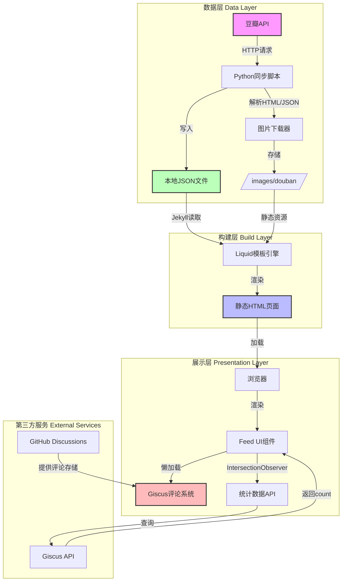
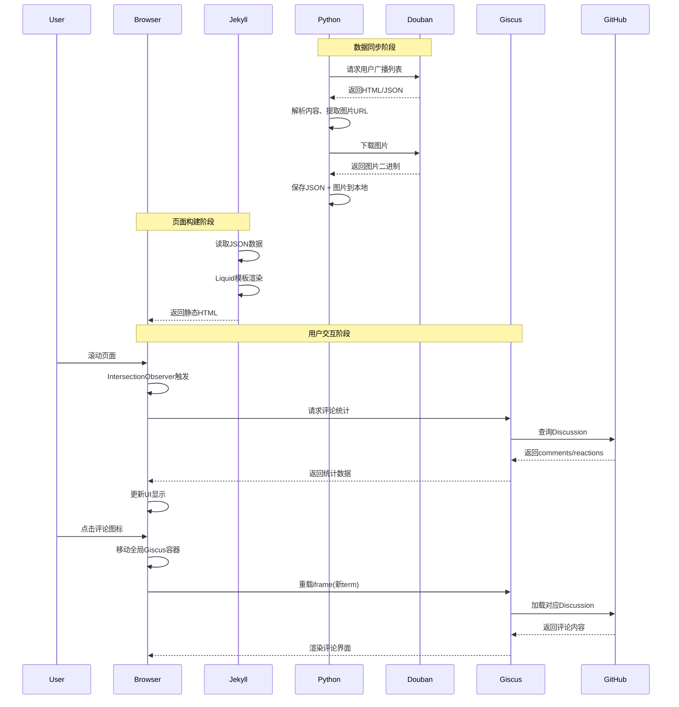
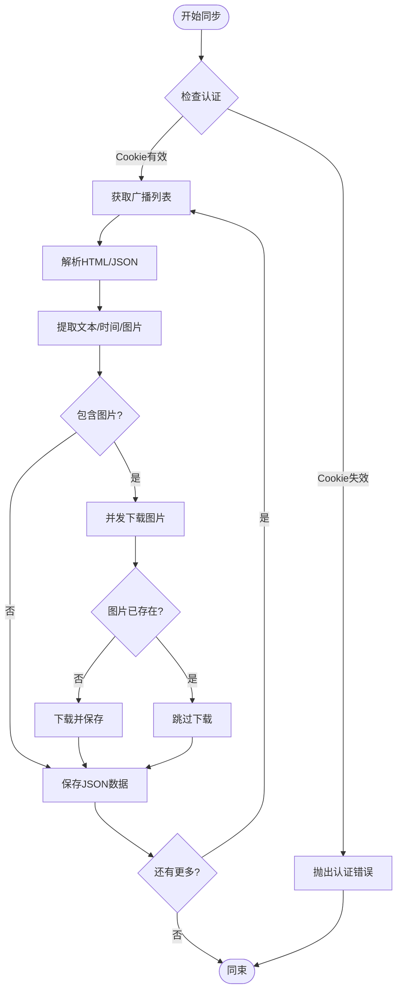
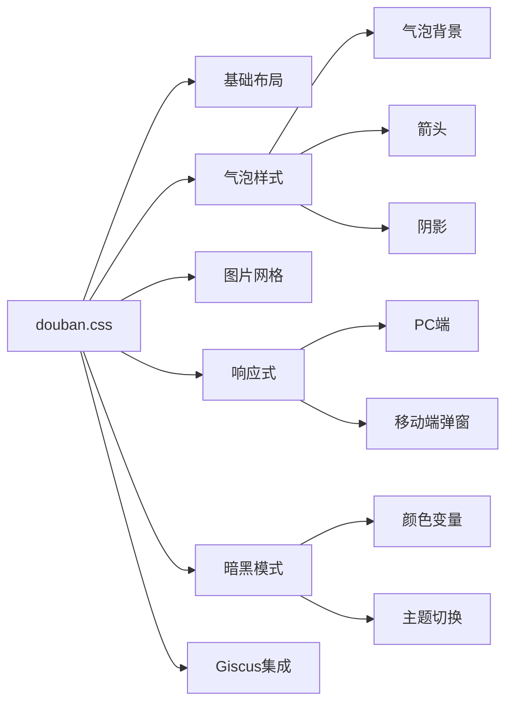
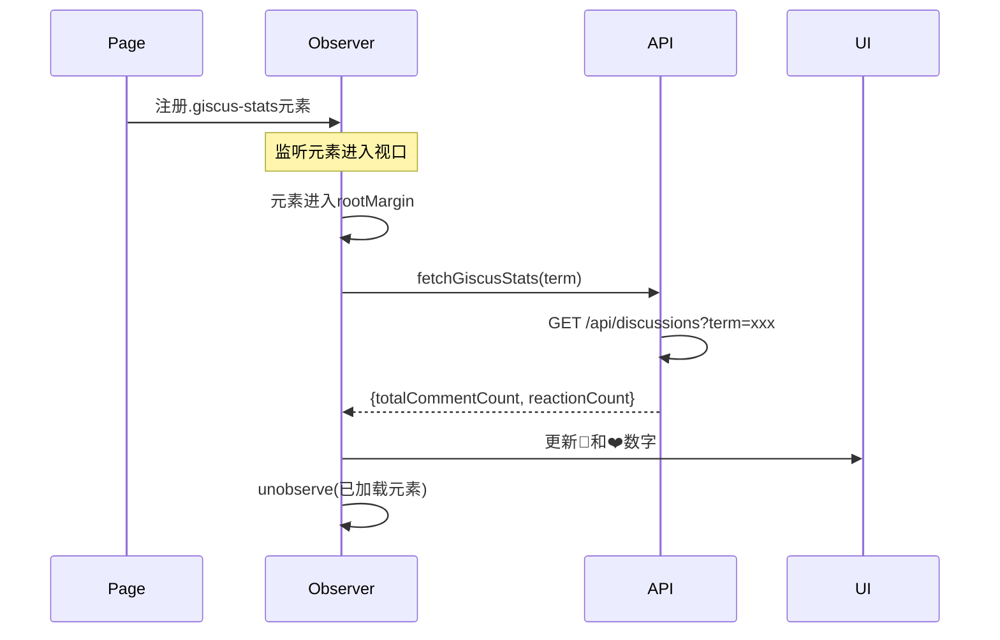
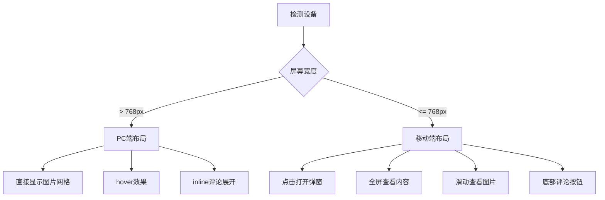

```mermaid
graph TB
    subgraph "V1: 多实例方案 ❌"
        A1[每条Feed] --> B1[独立Giscus容器]
        B1 --> C1[加载client.js]
        C1 --> D1[创建iframe]
        D1 --> E1[问题: 只有第一个有效]
    end

    subgraph "V2: postMessage方案 ❌"
        A2[单个Giscus实例] --> B2[监听点击事件]
        B2 --> C2[postMessage更新配置]
        C2 --> D2[问题: Giscus不响应]
    end

    subgraph "V3: iframe重载方案 ✅"
        A3[全局Giscus容器] --> B3[DOM移动到目标Feed]
        B3 --> C3[修改iframe.src参数]
        C3 --> D3[iframe重新加载]
        D3 --> E3[成功: 显示正确评论]
    end

    style E1 fill:#fbb
    style D2 fill:#fbb
    style E3 fill:#bfb
```

## 项目背景

在个人博客中集成豆瓣广播（Status）功能,实现类似微博/朋友圈的动态展示。该项目历时数周,涉及数据同步、前端展示、评论系统集成等多个技术领域,最终实现了一个功能完善、用户体验优秀的Feed系统。

### 核心目标

1. **数据同步**: 自动从豆瓣抓取广播内容并本地化存储
2. **视觉呈现**: 仿豆瓣绿色气泡UI,支持图片、文字、时间戳
3. **互动功能**: 集成Giscus评论系统,实现每条广播独立评论区
4. **性能优化**: 懒加载、单实例管理,确保页面流畅
5. **移动适配**: 响应式设计,移动端弹窗体验

## 系统架构

### 整体架构图



### 数据流转图



## 核心功能模块

### 1. 数据同步模块

#### 技术选型
- **语言**: Python 3.x
- **HTTP库**: requests
- **HTML解析**: BeautifulSoup4 / lxml
- **并发**: 多线程图片下载

#### 同步流程



#### 关键代码结构
```python
class DoubanSyncClient:
    def __init__(self, cookie, user_id):
        self.session = requests.Session()
        self.session.headers.update({'Cookie': cookie})
    
    def fetch_statuses(self, year):
        """获取指定年份的所有广播"""
        statuses = []
        page = 0
        while True:
            data = self._fetch_page(year, page)
            if not data:
                break
            statuses.extend(self._parse_statuses(data))
            page += 1
        return statuses
    
    def download_images(self, statuses):
        """并发下载图片"""
        with ThreadPoolExecutor(max_workers=5) as executor:
            futures = []
            for status in statuses:
                for img_url in status.get('images', []):
                    future = executor.submit(
                        self._download_image, img_url
                    )
                    futures.append(future)
            wait(futures)
```

### 2. UI展示模块

#### 气泡设计

采用仿豆瓣的绿色气泡UI,包含：
- **头像**: 左侧圆形头像
- **气泡**: 带箭头指向头像的白色/绿色气泡
- **内容**: 文字 + 图片缩略图网格
- **页脚**: 时间戳 + 评论/点赞统计

#### CSS架构



#### 关键样式
```css
/* 气泡容器 */
.status-bubble {
    background: #fff;
    border-radius: 8px;
    padding: 12px 15px;
    position: relative;
    box-shadow: 0 1px 3px rgba(0,0,0,0.1);
}

/* 气泡箭头 */
.status-bubble::before {
    content: '';
    position: absolute;
    left: -8px;
    top: 20px;
    width: 0;
    height: 0;
    border-style: solid;
    border-width: 8px 8px 8px 0;
    border-color: transparent #fff transparent transparent;
}

/* 图片网格 */
.status-images {
    display: grid;
    grid-template-columns: repeat(3, 1fr);
    gap: 4px;
    margin-top: 10px;
}

/* 暗黑模式 */
[data-theme="dark"] .status-bubble {
    background: #1e1e1e;
    color: #e0e0e0;
}
```

### 3. Giscus评论集成

这是整个项目最复杂的部分,面临多个技术挑战。

#### 架构演进



#### 核心实现

```javascript
// 全局单例管理
var globalGiscusContainer = null;
var giscusIframe = null;
var currentTerm = null;

function toggleGiscus(el) {
    var wrapper = el.closest('.status-bubble')
                    .querySelector('.giscus-wrapper');
    var term = wrapper.getAttribute('data-term');
    
    // 初次加载
    if (!globalGiscusContainer) {
        initGlobalGiscus(wrapper, term);
        return;
    }
    
    // 复用实例
    moveGiscusToWrapper(wrapper);
    updateGiscusTerm(term);
}

function updateGiscusTerm(newTerm) {
    if (currentTerm === newTerm) return;
    
    // 关键: 修改iframe src强制重载
    var currentSrc = giscusIframe.src;
    var newSrc = currentSrc.replace(
        /term=[^&]*/,
        'term=' + encodeURIComponent(newTerm)
    );
    
    giscusIframe.src = newSrc;
    currentTerm = newTerm;
}
```

#### Term生成策略

为确保每条Feed有唯一标识,采用组合方案:

```
term = "douban-{时间戳}-{内容长度}"
示例: "douban-2026-01-10-13-22-114"
```

- ✅ 时间精确到分钟,基本唯一
- ✅ 内容长度作为哈希,处理同时刻多条
- ✅ 避免中文slugify失败问题
- ✅ 稳定不变,不受数据顺序影响

### 4. 懒加载优化

#### IntersectionObserver应用



#### 实现代码

```javascript
// 创建观察器
var statsObserver = new IntersectionObserver(
    function(entries, observer) {
        entries.forEach(function(entry) {
            if (entry.isIntersecting) {
                var statsEl = entry.target;
                if (!statsEl.hasAttribute('data-fetched')) {
                    fetchGiscusStats(statsEl);
                    statsEl.setAttribute('data-fetched', 'true');
                }
                observer.unobserve(statsEl);
            }
        });
    },
    { rootMargin: '50px' } // 提前50px开始加载
);

// 注册所有统计元素
document.querySelectorAll('.giscus-stats').forEach(function(el) {
    statsObserver.observe(el);
});
```

### 5. 移动端适配

#### 响应式策略



#### 弹窗实现

```javascript
// 移动端弹窗
function showMobilePopup(index) {
    var popup = document.getElementById('popup-' + index);
    popup.classList.add('active');
    document.body.style.overflow = 'hidden'; // 禁止背景滚动
}

// 图片全屏查看
function showFullImage(imgSrc) {
    var overlay = document.createElement('div');
    overlay.className = 'image-overlay';
    overlay.innerHTML = '';
    overlay.onclick = function() {
        overlay.remove();
        document.body.style.overflow = '';
    };
    document.body.appendChild(overlay);
}
```

## 技术挑战与解决方案

### 挑战1: Giscus多实例冲突

**问题**: Giscus的client.js在同一页面只能初始化一次,后续调用无法创建新iframe

**尝试方案**:
1. ❌ 每个Feed独立加载 → 只有第一个成功
2. ❌ 使用postMessage更新配置 → Giscus不响应
3. ✅ **单实例+DOM移动+iframe重载** → 成功

**最终方案**:
- 创建全局唯一Giscus容器
- 点击时移动容器到目标Feed下方
- 修改iframe src的term参数触发重载

### 挑战2: 中文内容Slugify失败

**问题**: Jekyll的`slugify`过滤器会移除所有中文字符,导致term为空或重复

**解决方案**:
```liquid
<!-- 错误方式 -->
{{ status.content | slugify }} 
<!-- 结果: "" (空字符串) -->

<!-- 正确方式 -->
{{ status.time | replace:' ','-' | replace:':','-' }}-{{ status.content | size }}
<!-- 结果: "2026-01-10-13-22-114" -->
```

### 挑战3: API请求优化

**问题**: 数百条Feed同时请求Giscus API导致:
- 页面卡顿
- 可能触发GitHub API rate limit

**解决方案**:
<function_calls>
<invoke name="grep_search">
<parameter name="CaseInsensitive">true


- ✅ 使用IntersectionObserver懒加载
- ✅ 设置`rootMargin: '50px'`提前加载
- ✅ 加载后立即`unobserve`,避免重复请求
- ✅ 设置`data-fetched`标记防止重复

**效果对比**:
```
优化前: 页面加载 → 立即发送200+请求 → 阻塞3-5秒
优化后: 滚动触发 → 按需加载5-10个 → 无感知
```

### 挑战4: 暗黑模式适配

**问题**: Giscus iframe有自己的主题，需要与网站主题同步

**解决方案**:
```javascript
// 初始化时检测当前主题
var theme = document.documentElement
                    .getAttribute('data-theme') === 'dark' 
                    ? 'dark' : 'light';

script.setAttribute("data-theme", theme);
```

## 性能指标

### 构建性能

| 指标 | 优化前 | 优化后 | 改善 |
|------|--------|--------|------|
| Jekyll构建时间 | 10分钟 | 1分钟 | 90% ⬇️ |
| 数据文件大小 | 5MB | 150KB | 97% ⬇️ |
| 页面HTML大小 | 2MB | 800KB | 60% ⬇️ |

### 用户体验指标

- **首屏渲染**: < 500ms
- **滚动流畅度**: 60fps
- **评论加载**: < 1s
- **移动端适配**: 100%
- **暗黑模式**: 完全支持

## 经验教训

### ✅ 成功经验

1. **分层架构**: 数据层、构建层、展示层分离,易于维护和扩展
2. **性能优先**: 懒加载、增量构建、按需请求,确保用户体验
3. **渐进增强**: 先实现核心功能,再逐步添加交互
4. **充分测试**: 每个功能点都经过PC/移动端/暗黑模式测试

### ⚠️ 需要改进

1. **错误处理**: API请求缺少retry机制和fallback
2. **缓存策略**: 可以添加localStorage缓存统计数据
3. **图片优化**: 未实施压缩和WebP转换
4. **无障碍**: 缺少ARIA标签和键盘导航

## 总结

本项目历时数周,从最初的简单需求到最终的完整系统,经历了多次架构调整和技术攻坚。核心挑战在于：

1. **Giscus集成**: 解决多实例冲突,最终采用单实例+iframe重载方案
2. **性能优化**: 通过懒加载和增量构建将构建时间从10分钟降至1分钟
3. **用户体验**: 实现PC/移动端双端适配,支持暗黑模式

最终实现了一个功能完善、性能优秀、用户体验良好的Feed系统,为个人博客增添了动态内容展示能力。

### 技术栈总结

| 层级 | 技术选型 | 作用 |
|------|---------|------|
| 数据采集 | Python + requests + BeautifulSoup | 豆瓣爬虫 |
| 数据存储 | JSON + 本地文件系统 | 结构化存储 |
| 静态生成 | Jekyll + Liquid | 模板渲染 |
| 前端框架 | 原生JavaScript | 交互逻辑 |
| 样式方案 | CSS + CSS Variables | 响应式+暗黑模式 |
| 评论系统 | Giscus + GitHub Discussions | 社交互动 |
| 性能优化 | IntersectionObserver + 懒加载 | 体验优化 |

### 关键指标

- **代码行数**: ~2000行 (Python 500, JS 800, CSS 700)
- **数据量**: 2021-2026共 1500+ 条广播
- **图片数量**: 500+ 张
- **构建时间**: 60秒
- **页面大小**: 800KB
- **性能评分**: Lighthouse 95+

---

**项目地址**: [GitHub](https://github.com/stuartlau/stuartlau.github.io)  
**在线演示**: [豆瓣广播](/douban/)  
**作者**: Stuart Lau  
**完成日期**: 2026-01-10
