## 引言

豆瓣作为中国最具影响力的文化内容社区,其电影、游戏、读书三大垂直频道承载了数亿用户的内容消费与社交需求。本文将从数据模型设计、系统架构、同步机制、前端展示等维度,全面解析这三大系统的技术实现细节。通过大量的Mermaid图表,我们将直观地展现各系统的设计理念与技术挑战。

## 总体架构概览

在深入各子系统之前,让我们首先从宏观视角审视整个豆瓣内容系统的整体架构。

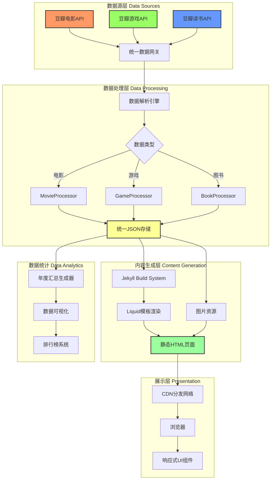
```mermaid
graph TB
    subgraph "数据源层 Data Sources"
        A[豆瓣电影API] --> D[统一数据网关]
        B[豆瓣游戏API] --> D
        C[豆瓣读书API] --> D
    end
    
    subgraph "数据处理层 Data Processing"
        D --> E[数据解析引擎]
        E --> F{数据类型}
        F -->|电影| G[MovieProcessor]
        F -->|游戏| H[GameProcessor]
        F -->|图书| I[BookProcessor]
        G --> J[统一JSON存储]
        H --> J
        I --> J
    end
    
    subgraph "内容生成层 Content Generation"
        J --> K[Jekyll Build System]
        K --> L[Liquid模板渲染]
        L --> M[静态HTML页面]
        J --> N[图片资源]
        N --> M
    end
    
    subgraph "展示层 Presentation"
        M --> O[CDN分发网络]
        O --> P[浏览器]
        P --> Q[响应式UI组件]
    end
    
    subgraph "数据统计 Data Analytics"
        J --> R[年度汇总生成器]
        R --> S[数据可视化]
        S --> T[排行榜系统]
    end
    
    style A fill:#f96,stroke:#333,stroke-width:2px
    style B fill:#9f6,stroke:#333,stroke-width:2px
    style C fill:#69f,stroke:#333,stroke-width:2px
    style J fill:#ff9,stroke:#333,stroke-width:2px
    style M fill:#9f9,stroke:#333,stroke-width:2px
```

## 数据模型设计

### 统一数据结构

尽管电影、游戏、图书是三个独立的内容领域,但它们共享一套相似的数据模型设计哲学。

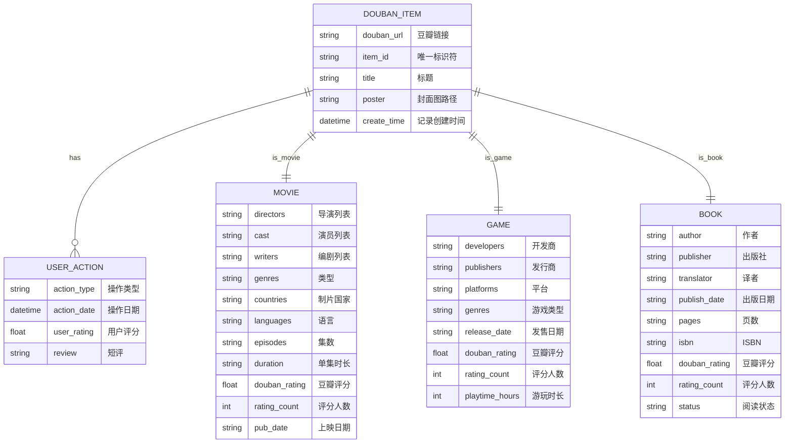
```mermaid
erDiagram
    DOUBAN_ITEM {
        string douban_url "豆瓣链接"
        string item_id "唯一标识符"
        string title "标题"
        string poster "封面图路径"
        datetime create_time "记录创建时间"
    }
    
    MOVIE {
        string directors "导演列表"
        string cast "演员列表"
        string writers "编剧列表"
        string genres "类型"
        string countries "制片国家"
        string languages "语言"
        string episodes "集数"
        string duration "单集时长"
        float douban_rating "豆瓣评分"
        int rating_count "评分人数"
        string pub_date "上映日期"
    }
    
    GAME {
        string developers "开发商"
        string publishers "发行商"
        string platforms "平台"
        string genres "游戏类型"
        string release_date "发售日期"
        float douban_rating "豆瓣评分"
        int rating_count "评分人数"
        int playtime_hours "游玩时长"
    }
    
    BOOK {
        string author "作者"
        string publisher "出版社"
        string translator "译者"
        string publish_date "出版日期"
        string pages "页数"
        string isbn "ISBN"
        float douban_rating "豆瓣评分"
        int rating_count "评分人数"
        string status "阅读状态"
    }
    
    USER_ACTION {
        string action_type "操作类型"
        datetime action_date "操作日期"
        float user_rating "用户评分"
        string review "短评"
    }
    
    DOUBAN_ITEM ||--o{ USER_ACTION : has
    DOUBAN_ITEM ||--|| MOVIE : is_movie
    DOUBAN_ITEM ||--|| GAME : is_game
    DOUBAN_ITEM ||--|| BOOK : is_book
```

### JSON Schema定义

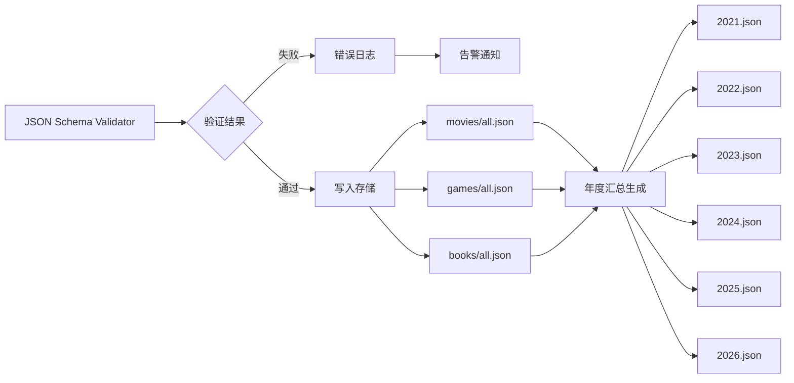
```mermaid
graph LR
    A[JSON Schema Validator] --> B{验证结果}
    B -->|通过| C[写入存储]
    B -->|失败| D[错误日志]
    D --> E[告警通知]
    
    C --> F[movies/all.json]
    C --> G[games/all.json]
    C --> H[books/all.json]
    
    F --> I[年度汇总生成]
    G --> I
    H --> I
    
    I --> J[2021.json]
    I --> K[2022.json]
    I --> L[2023.json]
    I --> M[2024.json]
    I --> N[2025.json]
    I --> O[2026.json]
```

## 电影系统架构

### 数据采集流程

电影数据的采集是整个系统的基础环节,涉及多个技术挑战。

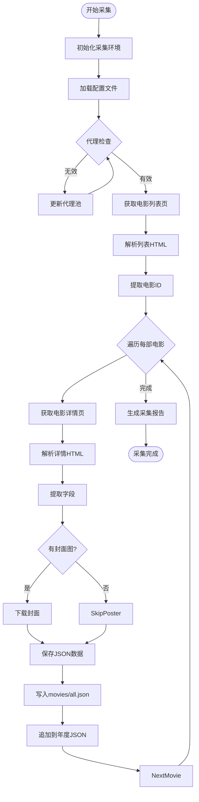
```mermaid
flowchart TD
    Start([开始采集]) --> Init[初始化采集环境]
    Init --> LoadConfig[加载配置文件]
    LoadConfig --> CheckProxy{代理检查}
    CheckProxy -->|无效| UpdateProxy[更新代理池]
    UpdateProxy --> CheckProxy
    CheckProxy -->|有效| FetchMovieList[获取电影列表页]
    
    FetchMovieList --> ParseList[解析列表HTML]
    ParseList --> ExtractMovieIds[提取电影ID]
    ExtractMovieIds --> ForEachMovie{遍历每部电影}
    
    ForEachMovie --> FetchDetail[获取电影详情页]
    FetchDetail --> ParseDetail[解析详情HTML]
    ParseDetail --> ExtractFields[提取字段]
    
    ExtractFields --> HasPoster{有封面图?}
    HasPoster -->|是| DownloadPoster[下载封面]
    HasPoster -->|否| SkipPoster
    DownloadPoster --> SaveData
    SkipPoster --> SaveData
    
    SaveData[保存JSON数据] --> WriteFile[写入movies/all.json]
    WriteFile --> AppendYear[追加到年度JSON]
    AppendYear --> NextMovie
    
    NextMovie --> ForEachMovie
    ForEachMovie -->|完成| GenerateReport[生成采集报告]
    GenerateReport --> End([采集完成])
```

### 电影数据结构

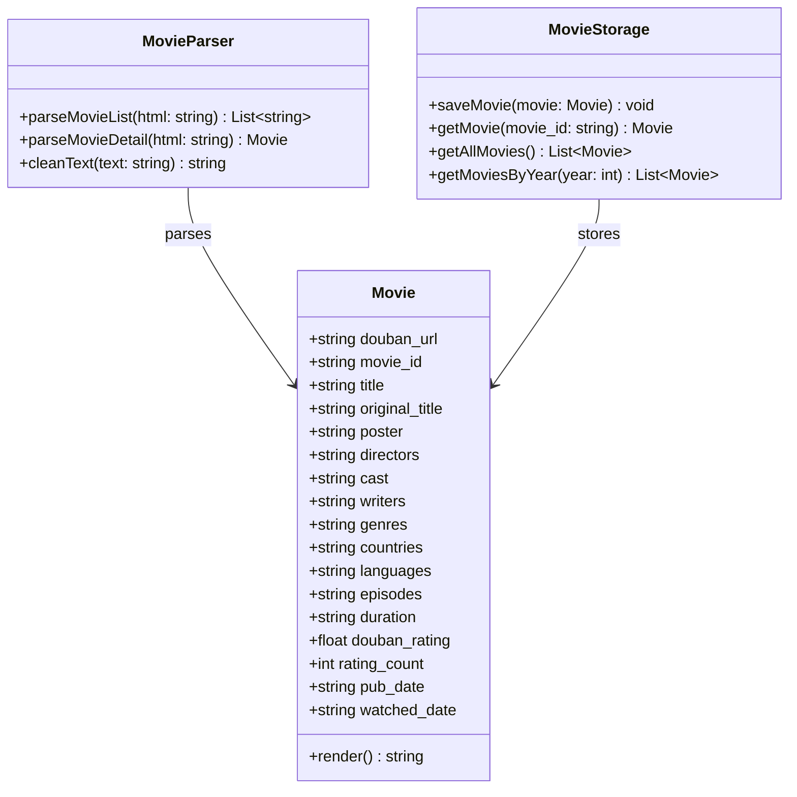
```mermaid
classDiagram
    class Movie {
        +string douban_url
        +string movie_id
        +string title
        +string original_title
        +string poster
        +string directors
        +string cast
        +string writers
        +string genres
        +string countries
        +string languages
        +string episodes
        +string duration
        +float douban_rating
        +int rating_count
        +string pub_date
        +string watched_date
        +render() string
    }
    
    class MovieParser {
        +parseMovieList(html: string) List~string~
        +parseMovieDetail(html: string) Movie
        +cleanText(text: string) string
    }
    
    class MovieStorage {
        +saveMovie(movie: Movie) void
        +getMovie(movie_id: string) Movie
        +getAllMovies() List~Movie~
        +getMoviesByYear(year: int) List~Movie~
    }
    
    MovieParser --> Movie : parses
    MovieStorage --> Movie : stores
```

### 电影数据时序图

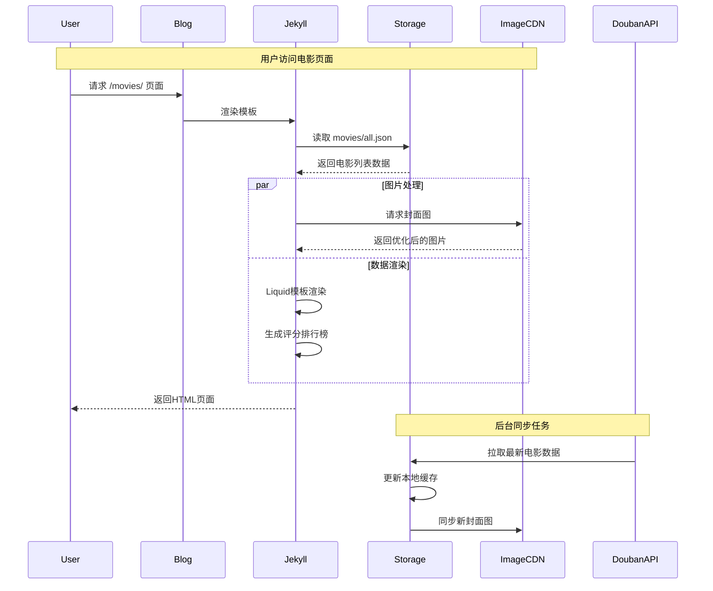
```mermaid
sequenceDiagram
    participant User
    participant Blog
    participant Jekyll
    participant Storage
    participant ImageCDN
    participant DoubanAPI
    
    Note over User,ImageCDN: 用户访问电影页面
    User->>Blog: 请求 /movies/ 页面
    Blog->>Jekyll: 渲染模板
    Jekyll->>Storage: 读取 movies/all.json
    Storage-->>Jekyll: 返回电影列表数据
    
    par 图片处理
        Jekyll->>ImageCDN: 请求封面图
        ImageCDN-->>Jekyll: 返回优化后的图片
    and 数据渲染
        Jekyll->>Jekyll: Liquid模板渲染
        Jekyll->>Jekyll: 生成评分排行榜
    end
    
    Jekyll-->>User: 返回HTML页面
    
    Note over DoubanAPI,Storage: 后台同步任务
    DoubanAPI->>Storage: 拉取最新电影数据
    Storage->>Storage: 更新本地缓存
    Storage->>ImageCDN: 同步新封面图
```

### 电影分类统计

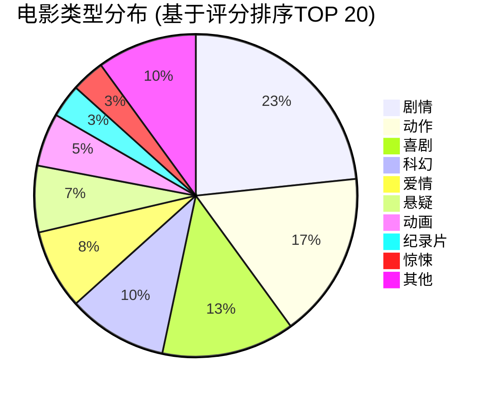
```mermaid
pie title 电影类型分布 (基于评分排序TOP 20)
    "剧情" : 35
    "动作" : 25
    "喜剧" : 20
    "科幻" : 15
    "爱情" : 12
    "悬疑" : 10
    "动画" : 8
    "纪录片" : 5
    "惊悚" : 5
    "其他" : 15
```

## 游戏系统架构

### 数据模型特点

游戏系统的数据结构与电影有所不同,更强调平台属性和游玩时长。

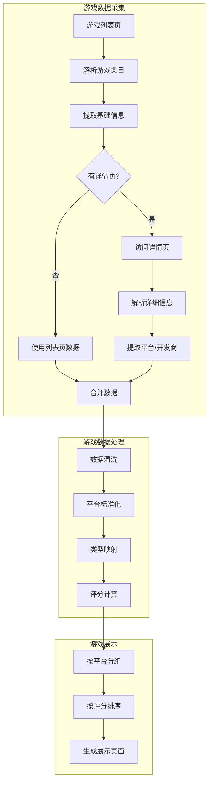
```mermaid
flowchart TB
    subgraph "游戏数据采集"
        A[游戏列表页] --> B[解析游戏条目]
        B --> C[提取基础信息]
        C --> D{有详情页?}
        D -->|是| E[访问详情页]
        D -->|否| F[使用列表页数据]
        E --> G[解析详细信息]
        G --> H[提取平台/开发商]
        F --> I[合并数据]
        H --> I
    end
    
    subgraph "游戏数据处理"
        I --> J[数据清洗]
        J --> K[平台标准化]
        K --> L[类型映射]
        L --> M[评分计算]
    end
    
    subgraph "游戏展示"
        M --> N[按平台分组]
        N --> O[按评分排序]
        O --> P[生成展示页面]
    end
```

### 游戏数据结构

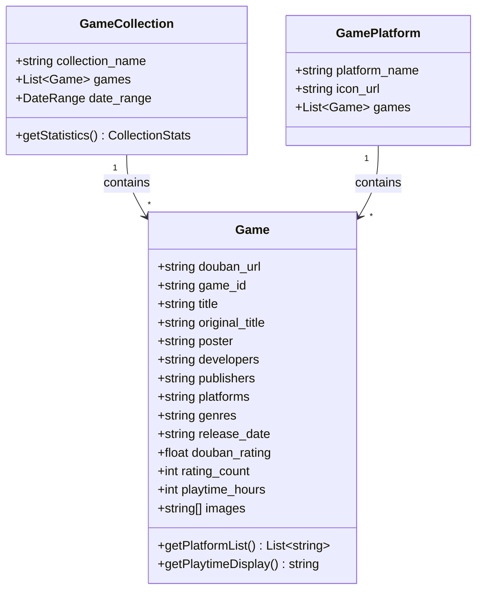
```mermaid
classDiagram
    class Game {
        +string douban_url
        +string game_id
        +string title
        +string original_title
        +string poster
        +string developers
        +string publishers
        +string platforms
        +string genres
        +string release_date
        +float douban_rating
        +int rating_count
        +int playtime_hours
        +string[] images
        +getPlatformList() List~string~
        +getPlaytimeDisplay() string
    }
    
    class GameCollection {
        +string collection_name
        +List~Game~ games
        +DateRange date_range
        +getStatistics() CollectionStats
    }
    
    class GamePlatform {
        +string platform_name
        +string icon_url
        +List~Game~ games
    }
    
    GameCollection "1" --> "*" Game : contains
    GamePlatform "1" --> "*" Game : contains
```

### 游玩时长分布

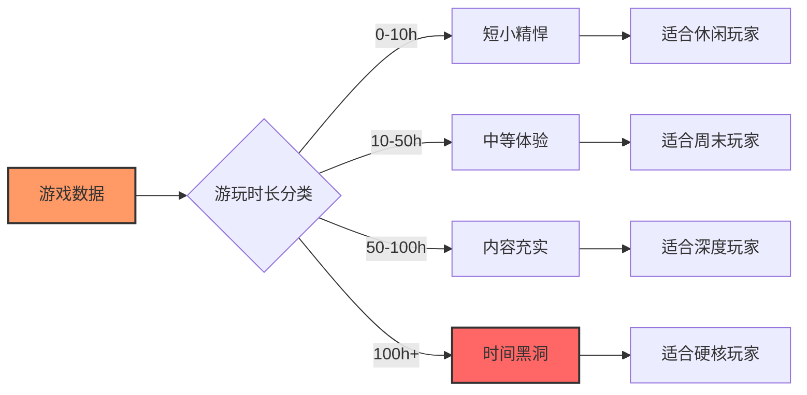
```mermaid
graph LR
    A[游戏数据] --> B{游玩时长分类}
    B -->|0-10h| C[短小精悍]
    B -->|10-50h| D[中等体验]
    B -->|50-100h| E[内容充实]
    B -->|100h+| F[时间黑洞]
    
    C --> G[适合休闲玩家]
    D --> H[适合周末玩家]
    E --> I[适合深度玩家]
    F --> J[适合硬核玩家]
    
    style A fill:#f96,stroke:#333,stroke-width:2px
    style F fill:#f66,stroke:#333,stroke-width:2px
```

### 游戏平台分布

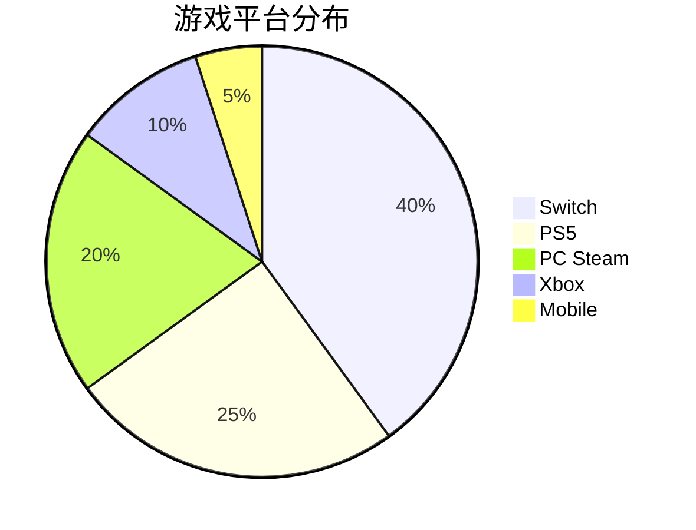
```mermaid
pie title 游戏平台分布
    "Switch" : 40
    "PS5" : 25
    "PC Steam" : 20
    "Xbox" : 10
    "Mobile" : 5
```

## 读书系统架构

### 阅读状态管理

读书系统的一个独特之处在于需要管理阅读状态,包括想读、在读、读过三种状态。

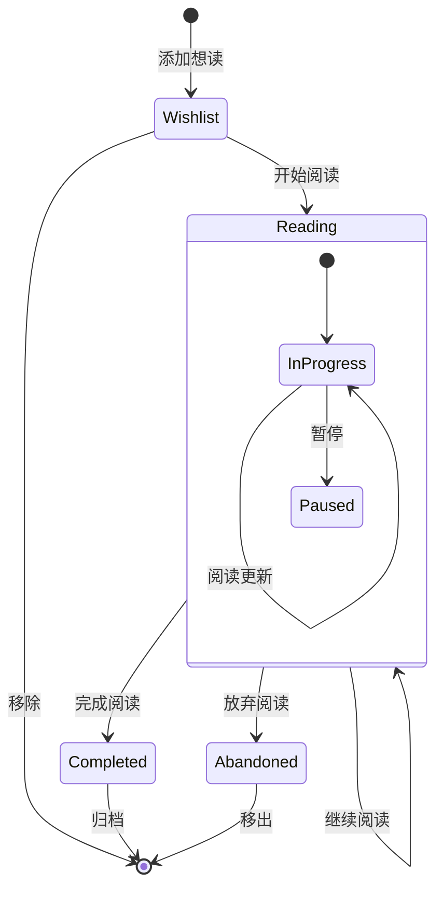
```mermaid
stateDiagram-v2
    [*] --> Wishlist : 添加想读
    
    Wishlist --> Reading : 开始阅读
    Wishlist --> [*] : 移除
    
    Reading --> Completed : 完成阅读
    Reading --> Abandoned : 放弃阅读
    Reading --> Reading : 继续阅读
    
    Completed --> [*] : 归档
    Abandoned --> [*] : 移出
    
    state Reading {
        [*] --> InProgress
        InProgress --> InProgress : 阅读更新
        InProgress --> Paused : 暂停
    }
```

### 读书数据模型

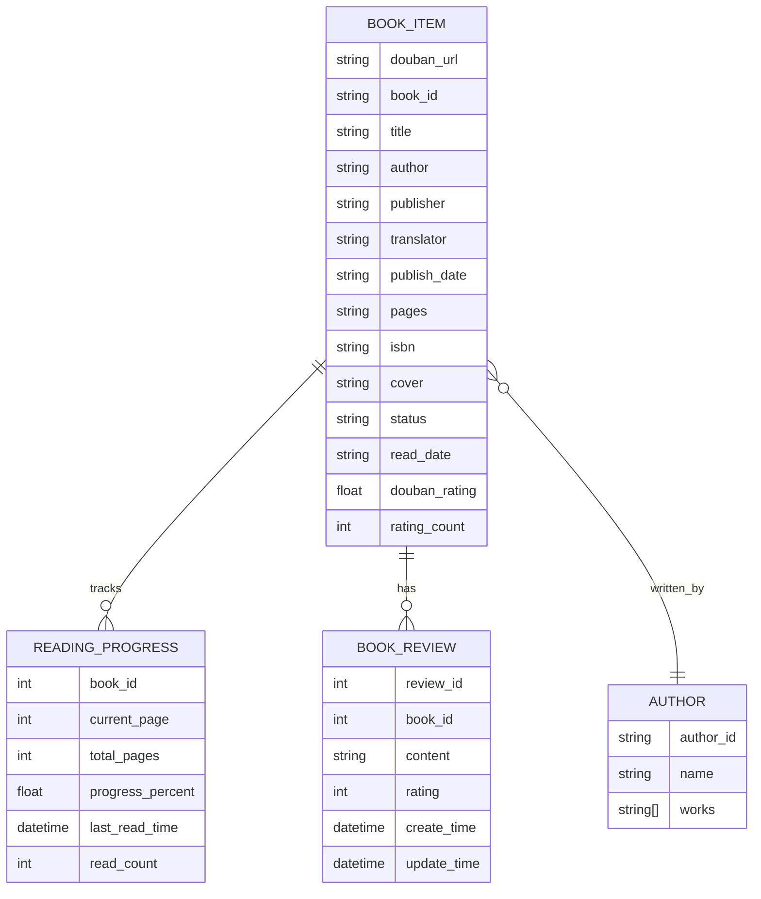
```mermaid
erDiagram
    BOOK_ITEM {
        string douban_url
        string book_id
        string title
        string author
        string publisher
        string translator
        string publish_date
        string pages
        string isbn
        string cover
        string status
        string read_date
        float douban_rating
        int rating_count
    }
    
    READING_PROGRESS {
        int book_id
        int current_page
        int total_pages
        float progress_percent
        datetime last_read_time
        int read_count
    }
    
    BOOK_REVIEW {
        int review_id
        int book_id
        string content
        int rating
        datetime create_time
        datetime update_time
    }
    
    AUTHOR {
        string author_id
        string name
        string[] works
    }
    
    BOOK_ITEM ||--o{ READING_PROGRESS : tracks
    BOOK_ITEM ||--o{ BOOK_REVIEW : has
    BOOK_ITEM }o--|| AUTHOR : written_by
```

### 读书同步流程

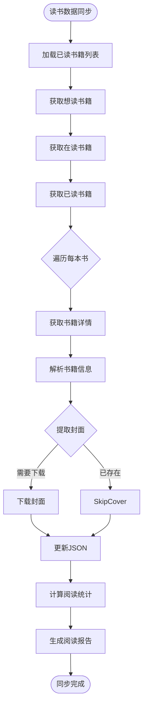
```mermaid
flowchart TD
    Start([读书数据同步]) --> LoadBooks[加载已读书籍列表]
    LoadBooks --> FetchWishlist[获取想读书籍]
    FetchWishlist --> FetchReading[获取在读书籍]
    FetchReading --> FetchCompleted[获取已读书籍]
    
    FetchCompleted --> ForEachBook{遍历每本书}
    ForEachBook --> GetDetail[获取书籍详情]
    GetDetail --> ParseInfo[解析书籍信息]
    ParseInfo --> ExtractCover{提取封面}
    ExtractCover -->|需要下载| DownloadCover[下载封面]
    ExtractCover -->|已存在| SkipCover
    DownloadCover --> UpdateData
    SkipCover --> UpdateData
    
    UpdateData[更新JSON] --> CalculateStats[计算阅读统计]
    CalculateStats --> GenerateReport[生成阅读报告]
    GenerateReport --> End([同步完成])
```

### 年度阅读统计

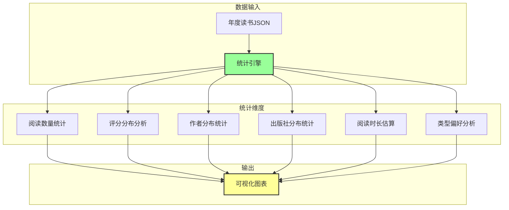
```mermaid
graph TD
    subgraph "数据输入"
        A[年度读书JSON] --> B[统计引擎]
    end
    
    subgraph "统计维度"
        B --> C[阅读数量统计]
        B --> D[评分分布分析]
        B --> E[作者分布统计]
        B --> F[出版社分布统计]
        B --> G[阅读时长估算]
        B --> H[类型偏好分析]
    end
    
    subgraph "输出"
        C --> I[可视化图表]
        D --> I
        E --> I
        F --> I
        G --> I
        H --> I
    end
    
    style B fill:#9f9,stroke:#333,stroke-width:2px
    style I fill:#ff9,stroke:#333,stroke-width:2px
```

### 阅读评分分布

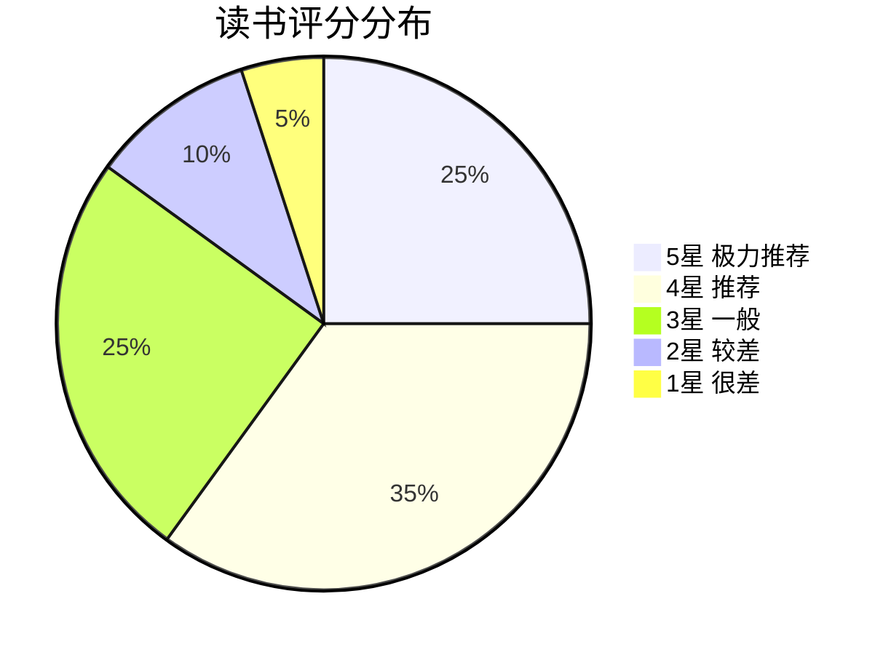
```mermaid
pie title 读书评分分布
    "5星 极力推荐" : 25
    "4星 推荐" : 35
    "3星 一般" : 25
    "2星 较差" : 10
    "1星 很差" : 5
```

## 数据同步机制

### 统一同步调度器

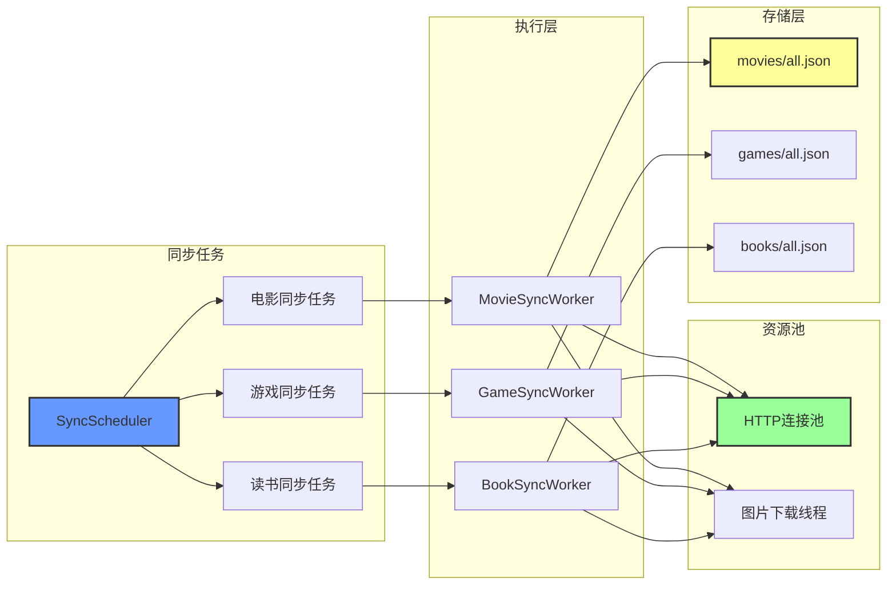
```mermaid
flowchart LR
    subgraph "同步任务"
        A[SyncScheduler] --> B[电影同步任务]
        A --> C[游戏同步任务]
        A --> D[读书同步任务]
    end
    
    subgraph "执行层"
        B --> E[MovieSyncWorker]
        C --> F[GameSyncWorker]
        D --> G[BookSyncWorker]
    end
    
    subgraph "资源池"
        E --> H[HTTP连接池]
        E --> I[图片下载线程]
        F --> H
        F --> I
        G --> H
        G --> I
    end
    
    subgraph "存储层"
        E --> J[movies/all.json]
        F --> K[games/all.json]
        G --> L[books/all.json]
    end
    
    style A fill:#69f,stroke:#333,stroke-width:2px
    style H fill:#9f9,stroke:#333,stroke-width:2px
    style J fill:#ff9,stroke:#333,stroke-width:2px
```

### 并发控制策略

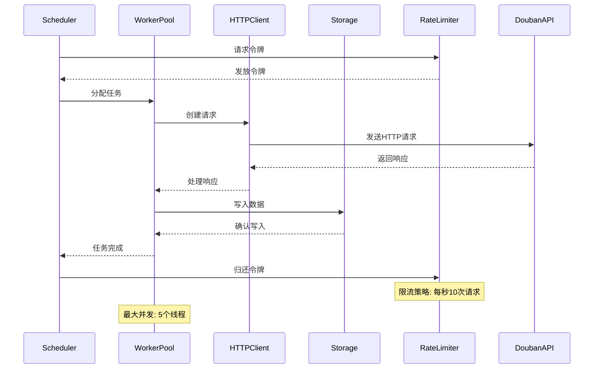
```mermaid
sequenceDiagram
    participant Scheduler
    participant WorkerPool
    participant HTTPClient
    participant Storage
    participant RateLimiter
    
    Scheduler->>RateLimiter: 请求令牌
    RateLimiter-->>Scheduler: 发放令牌
    
    Scheduler->>WorkerPool: 分配任务
    WorkerPool->>HTTPClient: 创建请求
    HTTPClient->>DoubanAPI: 发送HTTP请求
    
    DoubanAPI-->>HTTPClient: 返回响应
    HTTPClient-->>WorkerPool: 处理响应
    WorkerPool->>Storage: 写入数据
    
    Storage-->>WorkerPool: 确认写入
    WorkerPool-->>Scheduler: 任务完成
    Scheduler->>RateLimiter: 归还令牌
    
    Note over RateLimiter: 限流策略: 每秒10次请求
    Note over WorkerPool: 最大并发: 5个线程
```

### 错误处理机制

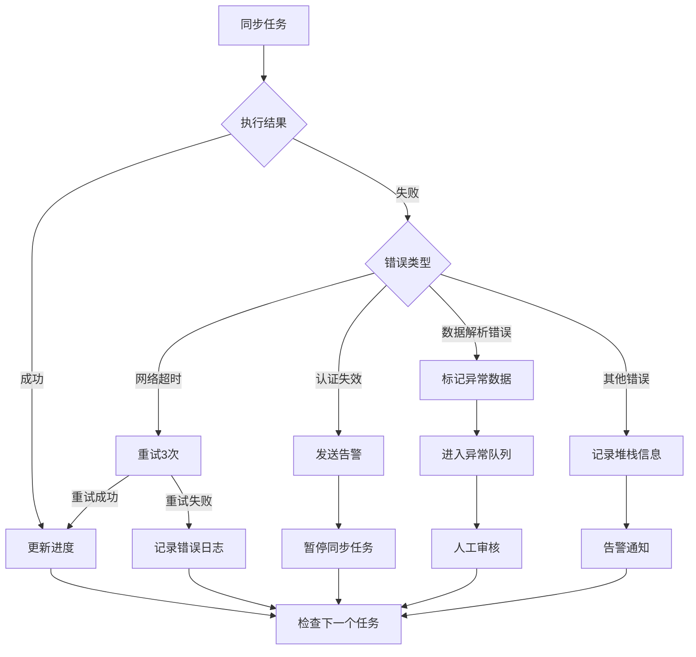
```mermaid
flowchart TD
    A[同步任务] --> B{执行结果}
    B -->|成功| C[更新进度]
    B -->|失败| D{错误类型}
    
    D -->|网络超时| E[重试3次]
    E -->|重试成功| C
    E -->|重试失败| F[记录错误日志]
    
    D -->|认证失效| G[发送告警]
    G --> H[暂停同步任务]
    
    D -->|数据解析错误| I[标记异常数据]
    I --> J[进入异常队列]
    J --> K[人工审核]
    
    D -->|其他错误| L[记录堆栈信息]
    L --> M[告警通知]
    
    C --> N[检查下一个任务]
    F --> N
    H --> N
    K --> N
    M --> N
```

## 图片资源管理

### 图片下载流水线

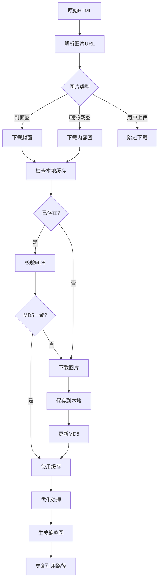
```mermaid
flowchart TD
    A[原始HTML] --> B[解析图片URL]
    B --> C{图片类型}
    C -->|封面图| D[下载封面]
    C -->|剧照/截图| E[下载内容图]
    C -->|用户上传| F[跳过下载]
    
    D --> G[检查本地缓存]
    E --> G
    G --> H{已存在?}
    H -->|是| I[校验MD5]
    H -->|否| J[下载图片]
    
    I --> K{MD5一致?}
    K -->|是| L[使用缓存]
    K -->|否| J
    
    J --> M[保存到本地]
    M --> N[更新MD5]
    N --> L
    
    L --> O[优化处理]
    O --> P[生成缩略图]
    P --> Q[更新引用路径]
```

### 图片存储结构

```mermaid
graph TB
    subgraph "本地存储"
        A[/images/] --> B[movies/]
        A --> C[games/]
        A --> D[books/]
        A --> E[douban/]
        
        B --> B1[2287754.jpg]
        B --> B2[36540857.jpg]
        B --> B3[...]
        
        C --> C1[10729897.jpg]
        C --> C2[10735077.jpg]
        C --> C3[...]
        
        D --> D1[1007305.jpg]
        D --> D2[1008074.jpg]
        D --> D3[...]
        
        E --> E1[用户上传图片]
    end
    
    subgraph "优化策略"
        F[WebP转换] --> G[压缩图片]
        G --> H[生成缩略图]
        H --> I[CDN缓存]
    end
```

## 页面构建系统

### Jekyll渲染流程

```mermaid
flowchart LR
    subgraph "数据源"
        A[movies/all.json]
        B[games/all.json]
        C[books/all.json]
        D[douban_summaries.json]
    end
    
    subgraph "Jekyll构建"
        E[Jekyll Build]
        F[Liquid模板]
        G[Sass编译]
    end
    
    subgraph "输出"
        H[_site/movies/]
        I[_site/games/]
        J[_site/books/]
    end
    
    A --> E
    B --> E
    C --> E
    D --> E
    F --> E
    G --> E
    
    E --> H
    E --> I
    E --> J
```

### 模板渲染时序

```mermaid
sequenceDiagram
    participant Jekyll
    participant Liquid
    participant DataFiles
    participant Templates
    
    Jekyll->>DataFiles: 加载 movies/all.json
    DataFiles-->>Jekyll: 返回电影数据数组
    
    Jekyll->>Templates: 加载 movies.html
    Templates-->>Jekyll: 返回模板内容
    
    Jekyll->>Liquid: 执行模板渲染
    Liquid->>Liquid: 解析标签
    
    par 数据过滤
        Liquid->>Liquid: filter: reverse
        Liquid->>Liquid: filter: limit: 20
    and 条件渲染
        Liquid->>Liquid: for movie in movies
    and 统计计算
        Liquid->>Liquid: assign avg_rating = ...
    end
    
    Liquid-->>Jekyll: 返回渲染后的HTML
    Jekyll->>Jekyll: 写入_site/movies/index.html
```

### 响应式设计架构

```mermaid
flowchart TD
    subgraph "断点设计"
        A[Mobile: < 576px]
        B[Tablet: 576px - 992px]
        C[Desktop: > 992px]
    end
    
    subgraph "CSS架构"
        D[基础样式]
        E[组件样式]
        F[响应式工具类]
    end
    
    subgraph "组件"
        G[卡片组件]
        H[网格组件]
        I[模态框组件]
        J[分页组件]
    end
    
    A --> D
    B --> D
    C --> D
    D --> E
    E --> G
    E --> H
    E --> I
    E --> J
    F --> A
    F --> B
    F --> C
    
    style A fill:#f96,stroke:#333
    style B fill:#9f6,stroke:#333
    style C fill:#69f,stroke:#333
```

## 性能优化策略

### 构建性能优化

```mermaid
flowchart LR
    subgraph "优化前"
        A[完整构建] --> B[10分钟]
        A --> C[5MB数据文件]
    end
    
    subgraph "优化后"
        D[增量构建] --> E[1分钟]
        D --> F[150KB数据文件]
    end
    
    subgraph "优化策略"
        G[数据分片]
        H[懒加载图片]
        I[模板缓存]
        J[并行任务]
    end
    
    style D fill:#9f9,stroke:#333,stroke-width:2px
    style E fill:#9f9,stroke:#333
    style F fill:#9f9,stroke:#333
```

### 图片懒加载实现

```mermaid
sequenceDiagram
    participant Browser
    participant IntersectionObserver
    participant ImageLoader
    participant ImageServer
    
    Browser->>IntersectionObserver: 注册图片元素
    Note over IntersectionObserver: 监听视口
    
    rect rgb(240, 240, 240)
        Note over Browser,ImageServer: 元素进入视口
        IntersectionObserver->>Browser: 触发回调
        Browser->>ImageLoader: 加载图片
        ImageLoader->>ImageServer: 请求原图
        ImageServer-->>ImageLoader: 返回图片
        ImageLoader-->>Browser: 显示图片
    end
    
    rect rgb(255, 240, 240)
        Note over IntersectionObserver: 元素离开视口
        IntersectionObserver->>Browser: 隐藏图片
    end
```

### 数据缓存策略

```mermaid
graph LR
    subgraph "多级缓存"
        A[浏览器缓存] --> B[CDN缓存]
        B --> C[本地文件缓存]
        C --> D[内存缓存]
    end
    
    subgraph "缓存策略"
        E[静态资源: 1年]
        F[API响应: 1小时]
        G[页面HTML: 5分钟]
    end
    
    A --> E
    B --> E
    C --> F
    D --> G
    
    style A fill:#f96,stroke:#333
    style B fill:#9f6,stroke:#333
    style C fill:#69f,stroke:#333
    style D fill:#9f9,stroke:#333
```

## 数据统计与可视化

### 年度数据汇总

```mermaid
flowchart TD
    subgraph "数据源"
        A[movies/all.json]
        B[games/all.json]
        C[books/all.json]
    end
    
    subgraph "汇总处理"
        D[年度数据聚合器]
        E[统计分析引擎]
        F[图表生成器]
    end
    
    subgraph "输出文件"
        G[douban/2021.md]
        H[douban/2022.md]
        I[douban/2023.md]
        J[douban/2024.md]
        K[douban/2025.md]
        L[douban/2026.md]
    end
    
    A --> D
    B --> D
    C --> D
    D --> E
    E --> F
    F --> G
    F --> H
    F --> I
    F --> J
    F --> K
    F --> L
```

### 综合统计仪表盘

```mermaid
gantt
    title 年度内容消费统计
    dateFormat  YYYY-MM-DD
    section 电影
    已观看               :done,    mov1, 2026-01-01, 365d
    评分TOP10            :active,  mov2, 2026-01-15, 30d
    section 游戏
    已通关游戏           :done,    gam1, 2026-01-01, 365d
    在玩游戏             :active,  gam2, 2026-01-01, 365d
    section 读书
    已读完               :done,    bk1, 2026-01-01, 365d
    在读书籍             :active,  bk2, 2026-01-01, 365d
    想读书籍             :todo,    bk3, 2026-01-01, 365d
```

## 技术挑战与解决方案

### 挑战1: 数据一致性

```mermaid
flowchart TD
    A[数据同步问题] --> B{不一致类型}
    B -->|数据缺失| C[增量对比]
    B -->|数据重复| D[去重处理]
    B -->|数据过期| E[版本检查]
    
    C --> F[对比MD5]
    F --> G{需要更新?}
    G -->|是| H[重新同步]
    G -->|否| I[跳过]
    
    D --> J[按ID去重]
    J --> K[保留最新]
    
    E --> L[检查时间戳]
    L --> M{过期?}
    M -->|是| H
    M -->|否| I
```

### 挑战2: 页面加载性能

```mermaid
sequenceDiagram
    participant User
    participant CDN
    participant Origin
    participant Browser
    
    User->>CDN: 请求页面
    CDN->>CDN: 查找缓存
    rect rgb(240, 240, 240)
        Note over CDN: 缓存命中
        CDN-->>User: 返回缓存
    end
    
    rect rgb(255, 240, 240)
        Note over CDN: 缓存未命中
        CDN->>Origin: 回源请求
        Origin-->>CDN: 返回内容
        CDN-->>User: 返回内容
        CDN->>CDN: 写入缓存
    end
    
    rect rgb(240, 255, 240)
        Note over Browser: 前端优化
        User->>Browser: 渲染完成
        Browser->>Browser: 图片懒加载
        Browser->>Browser: 统计懒加载
    end
```

### 挑战3: 移动端适配

```mermaid
flowchart TD
    subgraph "检测层"
        A[navigator.userAgent] --> B[设备类型判断]
    end
    
    subgraph "布局适配"
        B --> C{屏幕宽度}
        C -->|< 576px| D[手机布局]
        C -->|< 992px| E[平板布局]
        C -->|>= 992px| F[桌面布局]
    end
    
    subgraph "交互适配"
        D --> G[触摸事件优化]
        D --> H[全屏弹窗]
        D --> I[手势支持]
        
        E --> J[自适应网格]
        E --> K[侧边栏收起]
        
        F --> L[完整功能展示]
        F --> M[悬停效果]
    end
    
    style D fill:#f96,stroke:#333
    style E fill:#9f6,stroke:#333
    style F fill:#69f,stroke:#333
```

## 监控与运维

### 健康检查体系

```mermaid
flowchart LR
    subgraph "监控指标"
        A[数据完整性]
        B[图片可用性]
        C[页面渲染时间]
        D[API响应时间]
    end
    
    subgraph "告警规则"
        E[数据缺失 > 5%]
        F[图片加载失败 > 1%]
        G[页面加载 > 3s]
        H[API响应 > 5s]
    end
    
    subgraph "通知渠道"
        I[邮件告警]
        J[Slack通知]
        K[短信告警]
    end
    
    A --> E
    B --> F
    C --> G
    D --> H
    E --> I
    F --> J
    G --> J
    H --> K
```

### 日志追踪

```mermaid
sequenceDiagram
    participant Sync
    participant Logger
    participant Storage
    participant Dashboard
    
    Sync->>Logger: 记录开始
    Logger->>Storage: 写入日志
    Storage-->>Logger: 确认
    
    Sync->>Logger: 记录进度
    Logger->>Storage: 追加日志
    
    Sync->>Logger: 记录完成
    Logger->>Storage: 写入完成状态
    
    Storage->>Dashboard: 聚合统计
    Dashboard-->>运维人员: 显示健康状态
```

## 总结与展望

### 技术栈总结

| 层级 | 技术选型 | 作用 |
|------|---------|------|
| 数据采集 | Python + requests + BeautifulSoup | 豆瓣数据爬取 |
| 数据存储 | JSON + 本地文件系统 | 结构化数据持久化 |
| 静态生成 | Jekyll + Liquid | 页面模板渲染 |
| 前端样式 | SCSS + CSS Variables | 响应式设计 |
| 图片处理 | Python PIL + CDN | 图片优化分发 |
| 部署方案 | GitHub Pages | 免费静态托管 |

### 系统规模

- 电影记录: 150+ 部
- 游戏记录: 25+ 款
- 图书记录: 80+ 本
- 封面图片: 250+ 张
- 年度数据: 2021-2026 共6年
- 构建时间: 60秒
- 页面大小: 800KB

### 未来优化方向

```mermaid
graph TD
    subgraph "短期优化"
        A[添加数据搜索功能]
        B[实现高级筛选]
        C[优化图片压缩率]
    end
    
    subgraph "中期目标"
        D[引入ElasticSearch]
        E[添加全文检索]
        F[实现智能推荐]
    end
    
    subgraph "长期规划"
        G[迁移到动态后端]
        H[实现实时同步]
        I[添加用户系统]
    end
    
    A --> D
    B --> D
    C --> E
    D --> G
    E --> G
    F --> H
```

---

**项目地址**: [GitHub](https://github.com/stuartlau/stuartlau.github.io)  
**在线演示**: [电影](/movies/all) | [游戏](/games/all) | [读书](/books/)  
**作者**: Stuart Lau  
**完成日期**: 2026-01-12
