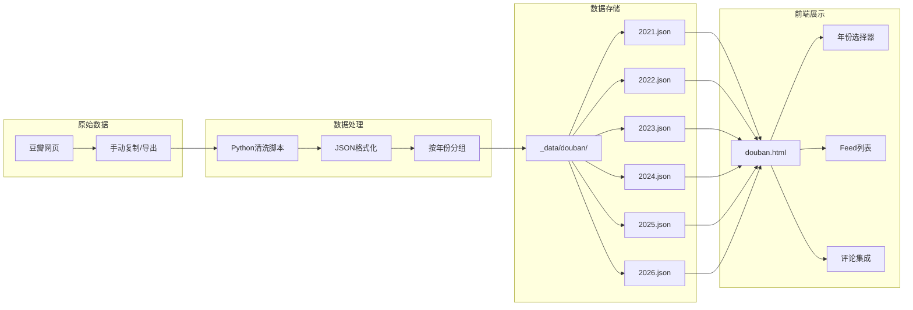
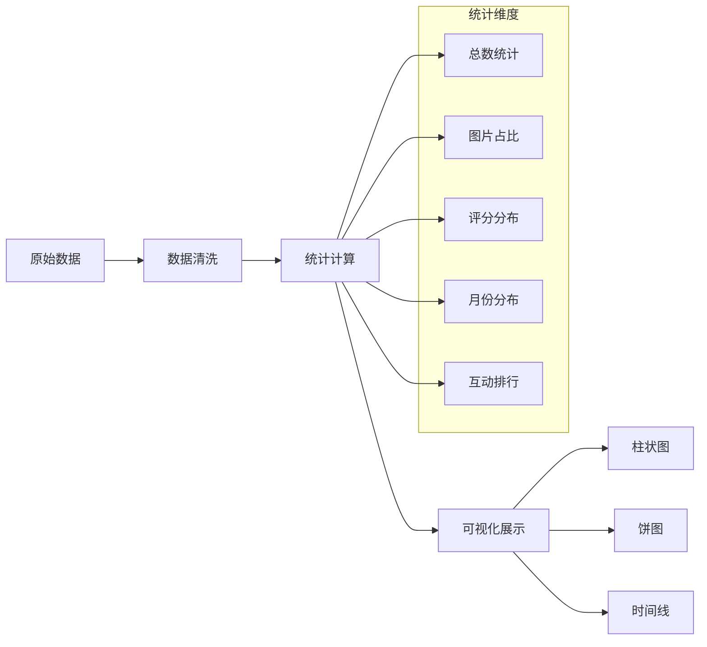
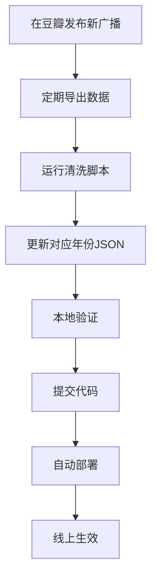

## 前言

本文介绍豆瓣广播（Broadcast）数据系统的设计与实现，包括数据采集、存储、API设计和前端展示的完整流程。通过该系统，我们将分散在不同年份的豆瓣广播数据整合到统一的页面中展示。

## 系统架构概览

### 整体架构设计

```
┌─────────────────────────────────────────────────────────────────────┐
│                         用户访问层                                    │
│              (浏览器 → GitHub Pages → 静态页面)                       │
├─────────────────────────────────────────────────────────────────────┤
│                         API接口层                                     │
│              (Jekyll Layouts → Data Files → JSON)                   │
├─────────────────────────────────────────────────────────────────────┤
│                         数据处理层                                    │
│         (Python脚本 → JSON清洗 → 按年份分组 → 统计汇总)              │
├─────────────────────────────────────────────────────────────────────┤
│                         数据源层                                      │
│        (豆瓣网页 → 手动导出 → 清洗处理 → 结构化存储)                  │
└─────────────────────────────────────────────────────────────────────┘
```

### 数据流转图



## 页面展示效果

> 📸 **截图位置**：请在此处插入豆瓣广播页面截图
> 
> 

如图所示，页面包含：
- 左侧用户头像和统计信息
- 中间Feed流展示区
- 右侧年份导航和热门年份提示

## 数据结构设计

### 广播数据模型

```yaml
# _data/douban/2026.json 示例
- time: "2026-01-12 20:30:45"
  content: "分享一段日常生活记录"
  images:
    - "https://img9.doubanio.com/view/photo/s/public/p1.jpg"
    - "https://img9.doubanio.com/view/photo/s/public/p2.jpg"
  my_rating: 5          # 可选，1-5分
  video_url: ""         # 可选，视频链接
  interact_info:        # 互动数据
    liked_count: 42
    comment_count: 5
    forward_count: 3
```

### 数据字段说明

| 字段 | 类型 | 说明 |
|------|------|------|
| `time` | String | 发布时间，格式：`YYYY-MM-DD HH:mm:ss` |
| `content` | String | 广播文本内容 |
| `images` | Array | 图片URL列表，支持多图 |
| `my_rating` | Integer | 个人评分（1-5），仅限读书/电影/游戏标记 |
| `video_url` | String | 视频链接（可选） |
| `interact_info` | Object | 互动统计数据 |

### 年份汇总统计

```json
// _data/douban_summaries.json
{
  "2026": {
    "count": 156,
    "with_images": 89,
    "with_videos": 12,
    "avg_rating": 4.2,
    "top_topics": ["旅行", "美食", "日常生活"]
  },
  "2025": {
    "count": 203,
    "with_images": 134,
    "with_videos": 18,
    "avg_rating": 4.0,
    "top_topics": ["育儿", "技术", "旅行"]
  }
}
```

## 前端实现

### 页面布局结构

```html
<div class="douban-container">
    <!-- 左侧边栏 -->
    <aside class="douban-sidebar">
        <div class="user-info">
            
            <h2>Stuart Lau</h2>
            <p class="nickname">@stuartlau</p>
        </div>
        <div class="stats">
            <div class="stat-item">
                <span class="stat-value">1200+</span>
                <span class="stat-label">广播</span>
            </div>
            <div class="stat-item">
                <span class="stat-value">50+</span>
                <span class="stat-label">书籍</span>
            </div>
        </div>
    </aside>
    
    <!-- 主内容区 -->
    <main class="douban-main">
        <!-- 年份选择器 -->
        <nav class="year-tabs">
            <a href="#2026" class="year-tab active">2026</a>
            <a href="#2025" class="year-tab">2025</a>
            ...
        </nav>
        
        <!-- Feed列表 -->
        <div class="feed-list">
            <!-- 广播条目 -->
        </div>
    </main>
</div>
```

### 广播条目组件

```
┌────────────────────────────────────────────────────────────┐
│  用户头像    @stuartlau        3Day 3h                     │
├────────────────────────────────────────────────────────────┤
│                                                             │
│  这是广播的文字内容，可能很长，可能包含多行                 │
│                                                             │
│  ┌────┐ ┌────┐ ┌────┐                                     │
│  │图1 │ │图2 │ │图3 │  图片网格展示                        │
│  └────┘ └────┘ └────┘                                     │
│                                                             │
├────────────────────────────────────────────────────────────┤
│  💬 ...  🔖 ...  ❤️ ...           点击展开评论             │
└────────────────────────────────────────────────────────────┘
```

### 相对时间格式化

```javascript
function formatTime(timeStr) {
    const now = new Date();
    const statusDate = new Date(timeStr.replace(' ', 'T'));
    const diffMs = now - statusDate;
    const diffDays = Math.floor(diffMs / (1000 * 60 * 60 * 24));
    const diffHours = Math.floor(diffMs / (1000 * 60 * 60));
    const diffMinutes = Math.floor(diffMs / (1000 * 60));

    if (diffDays < 7 && diffDays >= 0) {
        if (diffDays > 0) {
            return `${diffDays}Day ${diffHours % 24}h`;
        } else if (diffHours > 0) {
            return `${diffHours}h ${diffMinutes % 60}m`;
        } else {
            return `${diffMinutes}m`;
        }
    } else {
        // 超过7天显示具体日期
        const year = statusDate.getFullYear();
        const month = String(statusDate.getMonth() + 1).padStart(2, '0');
        const day = String(statusDate.getDate()).padStart(2, '0');
        return `${year}-${month}-${day}`;
    }
}
```

### 年份筛选逻辑

```javascript
// 使用data属性存储年份信息
document.querySelectorAll('.douban-status-item').forEach(item => {
    const itemYear = item.dataset.year;
    const targetYear = getCurrentYearFromHash();
    
    if (itemYear === targetYear || targetYear === 'all') {
        item.style.display = '';
    } else {
        item.style.display = 'none';
    }
});

// 简化：直接链接到不同页面
// /douban/2026.html, /douban/2025.html, ...
```

## 评论系统集成

### Giscus集成

```html
<!-- 使用Giscus实现GitHub Discussions评论 -->
<script 
    src="https://giscus.app/client.js"
    data-repo="stuartlau/stuartlau.github.io"
    data-repo-id="xxx"
    data-category="Announcements"
    data-category-id="xxx"
    data-mapping="pathname"
    data-strict="0"
    data-reactions-enabled="1"
    data-emit-metadata="0"
    data-input-position="bottom"
    data-theme="light"
    data-lang="zh-CN"
    crossorigin="anonymous"
    async>
</script>
```

### 评论动态加载

```javascript
function toggleGiscus(element) {
    const wrapper = element.closest('.douban-status-item')
                       .nextElementSibling
                       .querySelector('.giscus-wrapper');
    
    if (wrapper.style.display === 'none') {
        wrapper.style.display = 'block';
        // Giscus自动加载
        if (typeof giscus !== 'undefined') {
            giscus.configure();
        }
    } else {
        wrapper.style.display = 'none';
    }
}
```

## 数据统计与可视化

### 年度数据统计



### 统计展示效果

> 📸 **截图位置**：请在此处插入统计卡片截图
> 
> 

## 图片处理优化

### 图片网格布局

```css
.status-images {
    display: flex;
    gap: 8px;
    margin-top: 12px;
}

.status-image-thumb {
    width: 120px;
    height: 120px;
    background-size: cover;
    background-position: center;
    border-radius: 8px;
    cursor: pointer;
    transition: transform 0.2s;
}

.status-image-thumb:hover {
    transform: scale(1.05);
}
```

### 灯箱效果

```javascript
function openLightbox(imageUrl, allImages) {
    currentImages = allImages;
    currentImageIndex = currentImages.indexOf(imageUrl);
    
    const lb = document.getElementById('lightbox');
    document.getElementById('lightbox-img').src = imageUrl;
    lb.style.display = 'flex';
    document.body.style.overflow = 'hidden';
}

// 键盘导航
document.addEventListener('keydown', function(e) {
    const lb = document.getElementById('lightbox');
    if (lb.style.display === 'flex') {
        if (e.key === 'ArrowRight') nextLightboxImage();
        if (e.key === 'ArrowLeft') prevLightboxImage();
        if (e.key === 'Escape') closeLightbox();
    }
});
```

## 数据维护流程

### 添加新广播的流程



### 清洗脚本示例

```python
import json
import re
from datetime import datetime

def clean_douban_data(raw_text):
    """清洗豆瓣原始数据"""
    records = []
    
    for line in raw_text.strip().split('\n'):
        if not line.strip():
            continue
            
        # 解析时间
        time_match = re.search(r'(\d{4}-\d{2}-\d{2} \d{2}:\d{2}:\d{2})', line)
        if time_match:
            time_str = time_match.group(1)
            
            # 提取内容（去除时间和特殊字符）
            content = re.sub(r'\[\d{4}-\d{2}-\d{2} \d{2}:\d{2}:\d{2}\]', '', line)
            content = content.strip()
            
            records.append({
                'time': time_str,
                'content': content,
                'images': extract_images(content),
                'interact_info': {
                    'liked_count': '0',
                    'comment_count': '0'
                }
            })
    
    return records

def group_by_year(records):
    """按年份分组"""
    grouped = {}
    for record in records:
        year = record['time'][:4]
        if year not in grouped:
            grouped[year] = []
        grouped[year].append(record)
    
    return grouped
```

## 总结

本文介绍了豆瓣广播数据系统的完整实现：

| 模块 | 技术方案 |
|------|---------|
| 数据采集 | 手动导出 + Python清洗 |
| 数据存储 | Jekyll Data Files（YAML/JSON） |
| 页面生成 | Jekyll Layouts + Liquid模板 |
| 交互功能 | Vanilla JS（Tab切换、灯箱） |
| 评论系统 | Giscus（GitHub Discussions） |
| 部署方式 | GitHub Pages自动部署 |

该系统充分利用了静态站点的优势，实现了低运维成本的数据聚合展示。
