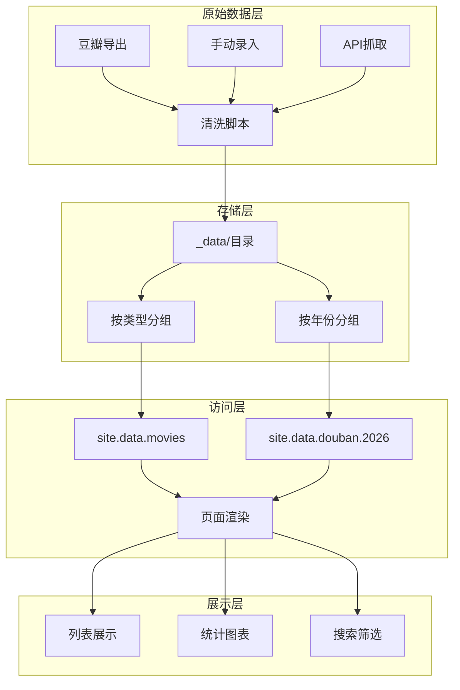

## 前言

在静态站点开发中，数据管理是一个核心话题。Jekyll提供了强大的Data Files功能，让我们可以以结构化的方式管理各类数据。本文分享我在个人网站中使用Jekyll数据管理的实践经验。

## Jekyll数据文件概述

### 数据文件存放位置

```
项目根目录/
├── _data/                    # 数据文件目录
│   ├── movies/
│   │   └── all.json         # 电影数据
│   ├── books/
│   │   └── all.json         # 图书数据
│   ├── games/
│   │   └── all.json         # 游戏数据
│   ├── douban/
│   │   ├── 2021.json
│   │   ├── 2022.json
│   │   ├── 2023.json
│   │   ├── 2024.json
│   │   ├── 2025.json
│   │   └── 2026.json
│   ├── douban_summaries.json
│   └── xiaohongshu.json     # 小红书数据
├── _config.yml
└── index.html
```

### 支持的格式

| 格式 | 文件扩展名 | 说明 |
|------|-----------|------|
| YAML | .yml, .yaml | 推荐，语法简洁 |
| JSON | .json | 适合程序生成 |
| CSV | .csv | 适合表格数据 |
| TSV | .tsv | Tab分隔的CSV |

## 数据组织策略

### 按类型分类

```
_data/
├── media/                   # 媒体数据
│   ├── movies/             # 电影
│   │   ├── all.json        # 全部
│   │   ├── 2024.json       # 按年分类（可选）
│   │   └── 2023.json
│   ├── books/              # 图书
│   └── games/              # 游戏
├── social/                  # 社交数据
│   ├── douban/             # 豆瓣广播
│   │   ├── 2021.json
│   │   ├── ...
│   │   └── 2026.json
│   └── xiaohongshu.json    # 小红书
└── profiles/                # 外部链接
    └── links.json
```

### 数据分层设计



## 数据访问方式

### 基本访问语法

```liquid
{# 访问全部电影 #}


{# 按年份访问豆瓣广播 #}


{# 访问数组元素 #}
{{ site.data.books.all[0].title }}

{# 条件过滤 #}

```

### 复杂查询示例

```liquid
{# 筛选评分大于4的图书 #}


{# 按分类筛选 #}


{# 排序 #}


{# 限制数量 #}


{# 聚合统计 #}



  


```

### 自定义数据访问

```ruby
# 在 _plugins/data_filters.rb 中添加自定义过滤器

module Jekyll
  module DataFilters
    
    def group_by(array, key)
      array.group_by { |item| item[key] }
    end
    
    def count_by(array, key)
      array.group_by { |item| item[key] }.transform_values(&:length)
    end
    
    def this_year(array, date_key = "date")
      current_year = Time.now.year.to_s
      array.select { |item| 
        item[date_key].to_s.start_with?(current_year)
      }
    end
    
    def this_month(array, date_key = "date")
      current_month = Time.now.strftime("%Y-%m")
      array.select { |item| 
        item[date_key].to_s.start_with?(current_month)
      }
    end
    
  end
end

Liquid::Template.register_filter Jekyll::DataFilters
```

## 数据验证与测试

### 使用Schema验证

```ruby
# _plugins/data_validator.rb

module DataValidator
  def self.validate_movies(data)
    required_keys = ['id', 'title', 'poster', 'my_rating']
    errors = []
    
    data.each_with_index do |movie, index|
      required_keys.each do |key|
        if movie[key].nil? || movie[key].empty?
          errors << "Row #{index}: missing #{key}"
        end
      end
      
      # 验证评分范围
      if movie['my_rating'] && (movie['my_rating'] < 0 || movie['my_rating'] > 5)
        errors << "Row #{index}: invalid rating #{movie['my_rating']}"
      end
    end
    
    errors
  end
end

# 在构建时验证
 Jekyll::Hooks.on :site_generate do |site|
   movies = site.data['movies']['all']
   errors = DataValidator.validate_movies(movies)
   if errors.any?
     puts "❌ Data validation errors:"
     errors.each { |e| puts "  - #{e}" }
     abort "Build failed due to data validation errors"
   else
     puts "✅ Movie data validation passed"
   end
 end
```

### 数据完整性检查脚本

```bash
#!/bin/bash
# scripts/check_data.sh

echo "🔍 Checking data files..."

# 检查必填字段
check_required_field() {
    local file=$1
    local field=$2
    local missing=$(jq "[.[] | select(.$field == null or .$field == \"\")] | length" "$file")
    if [ "$missing" -gt 0 ]; then
        echo "❌ $file: $missing items missing '$field'"
        return 1
    else
        echo "✅ $file: all items have '$field'"
        return 0
    fi
}

check_required_field "_data/movies/all.json" "id"
check_required_field "_data/books/all.json" "title"
check_required_field "_data/douban/2026.json" "time"

# 统计记录数
echo ""
echo "📊 Data counts:"
echo "  Movies: $(jq 'length' _data/movies/all.json)"
echo "  Books: $(jq 'length' _data/books/all.json)"
echo "  Games: $(jq 'length' _data/games/all.json)"
```

## 数据迁移与同步

### 从外部数据源同步

```python
#!/usr/bin/env python3
"""
同步外部数据到Jekyll数据文件
"""

import json
import os

def sync_movies():
    """同步电影数据"""
    source_file = "data/movies_export.json"
    dest_file = "_data/movies/all.json"
    
    with open(source_file, 'r') as f:
        movies = json.load(f)
    
    # 数据清洗和转换
    cleaned = []
    for movie in movies:
        cleaned.append({
            'id': movie['douban_id'],
            'title': movie['title'],
            'original_title': movie.get('original_title', ''),
            'poster': f"/images/movies/{movie['douban_id']}.jpg",
            'directors': movie.get('directors', []),
            'my_rating': movie.get('my_rating', 0),
            'watched_date': movie.get('watched_date', ''),
            'comment': movie.get('comment', '')
        })
    
    # 保存
    with open(dest_file, 'w', encoding='utf-8') as f:
        json.dump(cleaned, f, ensure_ascii=False, indent=2)
    
    print(f"✅ Synced {len(cleaned)} movies to {dest_file}")

def sync_douban():
    """同步豆瓣广播数据"""
    for year in ['2021', '2022', '2023', '2024', '2025', '2026']:
        source = f"data/douban_{year}.json"
        dest = f"_data/douban/{year}.json"
        
        if os.path.exists(source):
            with open(source, 'r') as f:
                data = json.load(f)
            with open(dest, 'w', encoding='utf-8') as f:
                json.dump(data, f, ensure_ascii=False, indent=2)
            print(f"✅ Synced {year}: {len(data)} posts")

if __name__ == "__main__":
    sync_movies()
    sync_douban()
```

### 数据版本控制

```bash
# 使用Git LFS管理大文件
git lfs track "_data/**/*.json"
git lfs track "_data/**/*.csv"

# 定期提交数据更新
git add _data/
git commit -m "data: update movies and douban posts - $(date +%Y-%m-%d)"
```

## 性能优化

### 大数据文件处理

```ruby
# _plugins/lazy_data_loader.rb
# 对于超大数据，使用懒加载

module DataLoader
  @@data_cache = {}
  
  def self.load_data(file_path)
    return @@data_cache[file_path] if @@data_cache[file_path]
    
    full_path = Jekyll.sanitized_path(Dir.pwd, file_path)
    if File.exist?(full_path)
      @@data_cache[file_path] = YAML.load_file(full_path)
    else
      @@data_cache[file_path] = []
    end
  end
  
  def self.clear_cache
    @@data_cache = {}
  end
end

# 使用
# 
```

### 索引文件优化

```json
// _data/movies/index.json
{
  "meta": {
    "last_updated": "2026-01-17",
    "total_count": 759,
    "version": "2.0"
  },
  "index": {
    "by_year": {
      "2025": 120,
      "2024": 150,
      "2023": 180,
      "2022": 200,
      "2021": 109
    },
    "by_rating": {
      "5": 45,
      "4": 280,
      "3": 320,
      "2": 100,
      "1": 14
    },
    "top_rated": [
      {"id": "1295644", "title": "肖申克的救赎", "rating": 5},
      {"id": "1292720", "title": "阿甘正传", "rating": 5}
    ]
  }
}
```

## 数据展示效果

### 页面展示截图

> 📸 **截图位置**：请在此处插入图书页面截图
> 
> 

图书页面展示效果，包含：
- 网格化封面展示
- 评分星级
- 阅读状态标记
- 筛选和排序功能

> 📸 **截图位置**：请在此处插入电影页面截图
> 
> 

电影页面展示效果，包含：
- 海报网格
- 评分统计
- 观影年份分布

## 最佳实践总结

| 实践 | 说明 |
|------|------|
| **目录结构清晰** | 按数据类型和年份分层组织 |
| **格式统一** | 全站使用同一种数据格式 |
| **版本控制** | 用Git管理数据变更 |
| **验证机制** | 构建时检查数据完整性 |
| **文档同步** | 更新数据时同步更新文档 |
| **备份策略** | 定期备份数据文件 |

### 数据管理检查清单

```markdown
- [ ] 数据文件存放位置正确
- [ ] 文件格式统一（YAML/JSON）
- [ ] 必填字段完整
- [ ] 数据类型正确（字符串、数字、数组）
- [ ] 无重复数据
- [ ] 更新时间记录
- [ ] 提交到版本控制
- [ ] 构建验证通过
```

## 总结

本文总结了Jekyll数据管理的最佳实践：

| 方面 | 建议 |
|------|------|
| 组织方式 | 按类型+年份分层 |
| 访问方式 | Liquid模板 + 自定义过滤器 |
| 验证机制 | 构建时自动检查 |
| 同步策略 | Python脚本自动化 |
| 性能优化 | 懒加载 + 索引文件 |

合理的数据管理是静态站点长期维护的关键，建议建立规范的数据处理流程，减少人工操作带来的错误。
