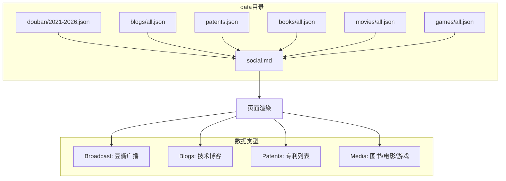
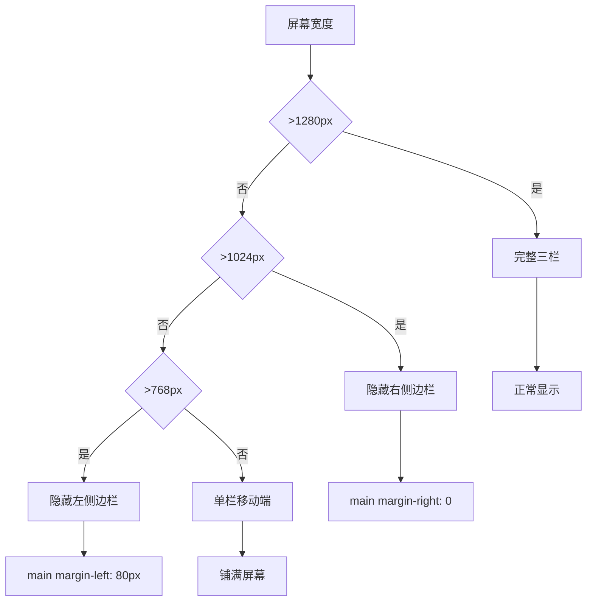
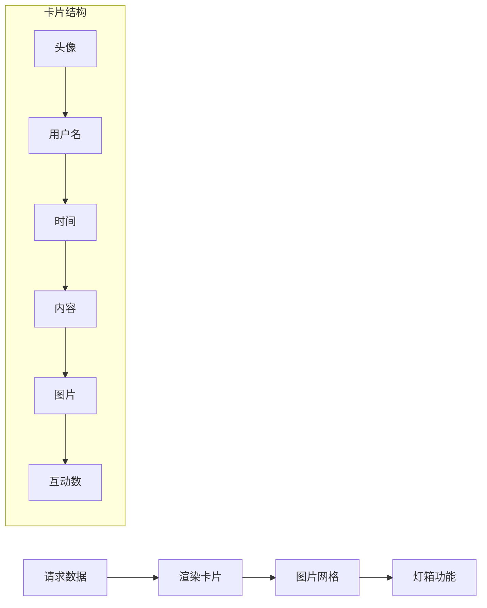

## 前言

本文介绍个人网站社交页面的设计思路和架构实现。该页面采用类似Twitter的三栏布局，整合了微博/豆瓣广播、博客、专利、影视游戏书籍等多种社交内容，实现统一的信息聚合展示。

## 整体架构

### 页面布局设计

```
┌─────────────────────────────────────────────────────────────┐
│                        顶部导航                              │
├────────────────┬─────────────────────────────────┬──────────┤
│                │                                 │          │
│  左侧固定边栏   │       主内容区域                │ 右侧固定  │
│  (Navigation)  │       (Scrollable)             │ (Widgets)│
│                │                                 │          │
│  • Home        │  ┌─────────────────────────┐   │          │
│  • Blogs       │  │    Profile Header       │   │  GitHub  │
│  • Patents     │  ├─────────────────────────┤   │          │
│  • Travel      │  │    Tab Navigation       │   │ LinkedIn │
│  • Books       │  ├─────────────────────────┤   │          │
│  • Movies      │  │    Content Panels       │   │   Email  │
│  • Games       │  │  (Broadcast/Blogs/etc)  │   │          │
│                │  └─────────────────────────┘   │          │
│                │                                 │          │
└────────────────┴─────────────────────────────────┴──────────┘
```

### 技术栈

| 层级 | 技术选型 | 说明 |
|------|---------|------|
| 布局框架 | CSS Flexbox/Grid | 三栏响应式布局 |
| 样式方案 | 原生CSS | 移动端适配 |
| 数据源 | Jekyll Data Files | _data/目录下的JSON |
| 页面生成 | Jekyll Layouts | 静态页面构建 |
| 交互逻辑 | Vanilla JavaScript | Tab切换、图片灯箱 |

## 数据架构设计

### 数据源整合



### 数据结构示例

```yaml
# _data/douban/2026.json
- time: "2026-01-12 20:30"
  content: "分享一段文字"
  images:
    - "https://image.xxx.com/1.jpg"
  my_rating: 5

# _data/books/all.json
- title: "设计模式"
  author: "GoF"
  cover: "/images/books/xxx.jpg"
  my_rating: 4
  status: "已读"
```

## 前端实现细节

### CSS架构

```css
/* 三栏基础布局 */
.social-layout {
    display: flex;
    max-width: 1300px;
    margin: 0 auto;
}

/* 左侧固定边栏 */
.social-left-sidebar {
    position: fixed;
    width: 280px;
    height: 100vh;
}

/* 中间主内容 */
.social-main {
    flex: 1;
    margin-left: 280px;  /* 左侧宽度 */
    margin-right: 350px; /* 右侧宽度 */
    min-height: 100vh;
}

/* 右侧固定边栏 */
.social-right-sidebar {
    position: fixed;
    right: 0;
    width: 350px;
    height: 100vh;
}
```

### 响应式断点



### Tab切换实现

```javascript
document.addEventListener('DOMContentLoaded', function() {
    const tabItems = document.querySelectorAll('.tab-item');
    const panels = document.querySelectorAll('.content-panel');

    tabItems.forEach(function(item) {
        item.addEventListener('click', function(e) {
            e.preventDefault();
            var targetTab = this.getAttribute('data-tab');
            
            // 更新Tab状态
            tabItems.forEach(function(tab) { 
                tab.classList.remove('active'); 
            });
            this.classList.add('active');
            
            // 切换内容面板
            panels.forEach(function(panel) {
                panel.classList.remove('active');
            });
            const activePanel = document.getElementById(targetTab + '-panel');
            if (activePanel) activePanel.classList.add('active');
            
            // 更新URL Hash
            history.pushState(null, null, '#' + targetTab);
        });
    });
});
```

## 内容面板设计

### 广播面板 (Broadcast)



### 博客面板

```
┌──────────────────────────────────────┐
│  博客卡片                             │
├──────────────────────────────────────┤
│  标题                                │
│  ├── 文章标题（主标题）                │
│  └── 副标题/描述（可选）              │
├──────────────────────────────────────┤
│  内容摘要                            │
│  ├── 自动截取前200字                 │
│  └── 支持自定义description字段        │
├──────────────────────────────────────┤
│  元信息                              │
│  ├── 日期                            │
│  └── 标签/分类                       │
└──────────────────────────────────────┘
```

### 媒体面板

```css
/* 媒体网格布局 */
.media-grid {
    display: flex;
    flex-wrap: wrap;
    gap: 12px;
}

.media-item {
    display: flex;
    flex-direction: column;
    align-items: center;
    width: 80px;
}

.media-item img {
    width: 70px;
    height: 100px;
    object-fit: cover;
    border-radius: 6px;
}
```

## 性能优化策略

### 图片懒加载

```javascript
// 使用loading="lazy"属性


// 或Intersection Observer实现
const observer = new IntersectionObserver((entries) => {
    entries.forEach(entry => {
        if (entry.isIntersecting) {
            const img = entry.target;
            img.src = img.dataset.src;
            observer.unobserve(img);
        }
    });
});
```

### 虚拟列表/分页

```javascript
function loadMore(listId) {
    const list = document.getElementById(listId);
    const hiddenItems = Array.from(list.querySelectorAll('.expandable-item'))
        .filter(el => el.style.display === 'none');
    
    // 每次加载10条
    for (let i = 0; i < Math.min(hiddenItems.length, 10); i++) {
        hiddenItems[i].style.display = '';
    }
    
    // 隐藏按钮如果全部加载完成
    const remaining = list.querySelectorAll('.expandable-item[style*="display: none"]');
    if (remaining.length === 0) {
        const btn = list.parentElement.querySelector('.load-more-btn');
        if (btn) btn.style.display = 'none';
    }
}
```

### CSS优化

```css
/* 使用CSS变量减少重复 */
:root {
    --primary-color: #1d9bf0;
    --bg-color: #fff;
    --text-color: #0f1419;
}

/* 使用will-change优化动画 */
.hover-effect {
    will-change: transform;
    transition: transform 0.2s ease;
}
```

## 用户体验设计

### 交互反馈

| 场景 | 反馈方式 |
|------|---------|
| Tab切换 | 立即切换，高亮当前 |
| 按钮点击 | hover状态 + active状态 |
| 图片加载 | loading占位 + fadein |
| 加载更多 | spinner动画 + 加载完成提示 |
| 图片灯箱 | 遮罩层 + 左右切换按钮 |

### 视觉层级

```
┌─────────────────────────────────────────────┐
│  一级：主要内容                              │
│  ├── 卡片标题（16px, bold）                 │
│  └── 卡片内容（14px, regular）              │
├─────────────────────────────────────────────┤
│  二级：辅助信息                              │
│  ├── 日期/来源（13px, gray）               │
│  └── 互动数据（13px, gray）                │
├─────────────────────────────────────────────┤
│  三级：装饰元素                              │
│  ├── 分隔线（1px, #eff3f4）                │
│  └── 背景色（#f7f9f9）                     │
└─────────────────────────────────────────────┘
```

## 扩展性考虑

### 插件化设计

```javascript
// 面板配置
const panels = {
    'posts': { 
        title: 'Broadcast',
        dataSource: 'douban',
        template: 'feed-item'
    },
    'blogs': { 
        title: 'Blogs',
        dataSource: 'blogs',
        template: 'blog-card'
    },
    'patents': { 
        title: 'Patents',
        dataSource: 'patents',
        template: 'patent-card'
    },
    'media': { 
        title: 'Media',
        dataSource: ['books', 'movies', 'games'],
        template: 'media-grid'
    }
};

// 动态注册面板
function registerPanel(key, config) {
    panels[key] = config;
    renderTab(key, config);
}
```

### 主题切换

```css
[data-theme="light"] {
    --bg-color: #ffffff;
    --text-color: #0f1419;
}

[data-theme="dark"] {
    --bg-color: #000000;
    --text-color: #e7e9ea;
}
```

## 总结

本文介绍了社交页面的核心设计：

| 方面 | 方案 |
|------|------|
| 布局 | Twitter风格三栏（固定+滚动+固定） |
| 数据 | Jekyll Data Files统一管理 |
| 交互 | Vanilla JS实现Tab切换和灯箱 |
| 响应式 | CSS Media Queries三档适配 |
| 性能 | 懒加载 + 分页加载 |
| 扩展 | 插件化面板注册 + 主题切换 |

该设计平衡了信息密度和用户体验，通过静态生成保证了加载性能，同时保留了良好的交互体验。
