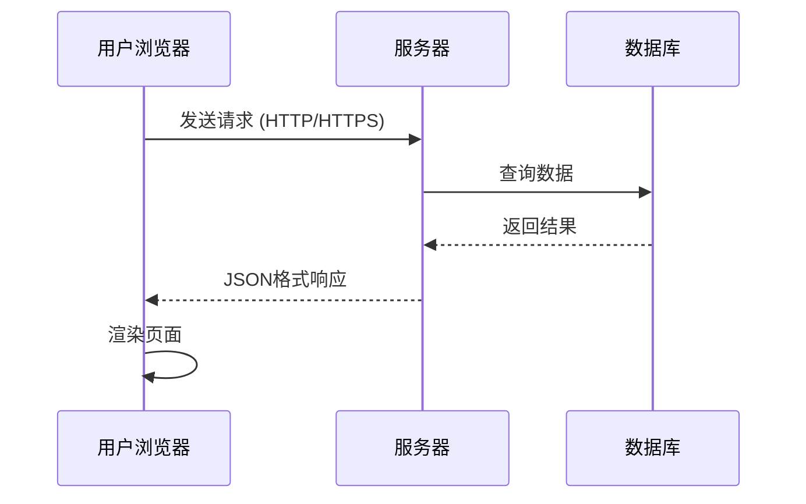
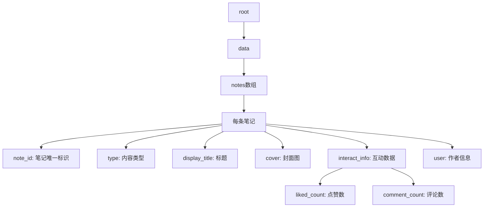
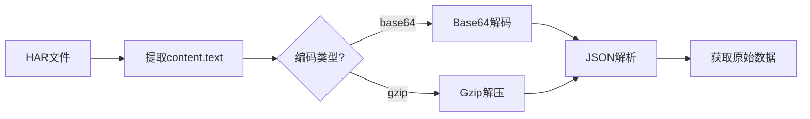
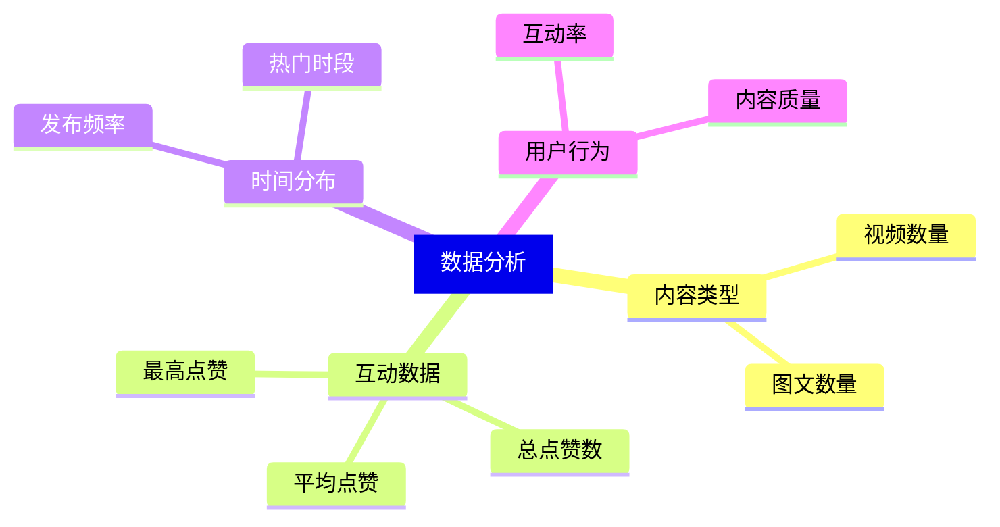
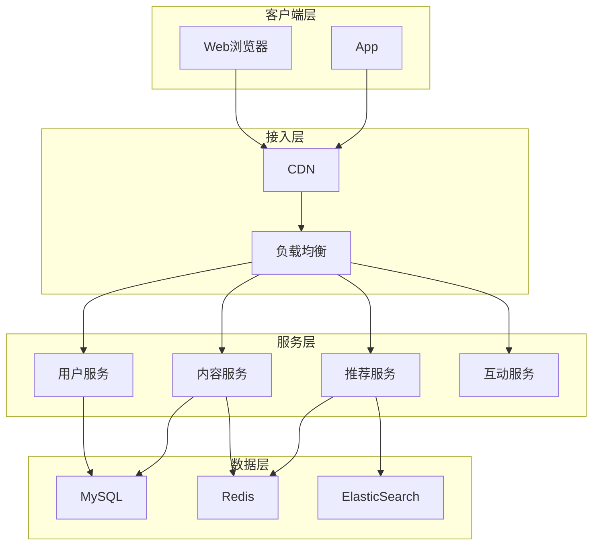

## 前言

在日常浏览网页时，你是否好奇过：页面是如何加载数据的？点赞数、评论、用户信息这些数据是从哪里来的？本文将以小红书为例，介绍如何通过浏览器开发者工具理解Web应用的数据交互机制。

## Web应用的数据交互模型

现代Web应用普遍采用**前后端分离**架构：



### 关键概念

| 概念 | 说明 |
|------|------|
| **API** | 应用程序接口，定义前后端通信规范 |
| **HTTP请求** | 浏览器向服务器获取数据的方式 |
| **JSON** | 轻量级数据交换格式，易于阅读和解析 |
| **状态码** | 如200(成功)、404(未找到)、500(服务器错误) |

## 浏览器开发者工具使用指南

### 打开Network面板

1. 在网页上右键 → 选择「检查」或按 `F12`
2. 切换到 **Network** 标签
3. 刷新页面，观察网络请求

### 理解请求结构

```
请求组成：
├── 请求行: GET /api/user/posts HTTP/1.1
├── 请求头: Cookie, User-Agent, Content-Type...
├── 请求体: POST请求时发送的数据
└── 响应: 服务器返回的数据
```

### 响应类型识别

| 类型 | Content-Type | 用途 |
|------|-------------|------|
| JSON | application/json | 结构化数据 |
| HTML | text/html | 页面内容 |
| 图片 | image/* | 图片资源 |
| 字体 | font/* | 字体文件 |

## 数据结构解析 - 以小红书为例

### API请求示例

```
GET https://edith.xiaohongshu.com/api/sns/web/v1/user_posted
    ?num=30
    &cursor=xxx
    &user_id=xxx
    &image_formats=jpg,webp,avif
```

### 响应数据结构

```json
{
  "code": 0,
  "success": true,
  "msg": "请求成功",
  "data": {
    "notes": [
      {
        "note_id": "66138838000000001a011385",
        "type": "video",
        "display_title": "我来过好几次了",
        "cover": {
          "info_list": [
            {
              "image_scene": "WB_PRV",
              "url": "http://sns-webpic-qc.xhscdn.com/..."
            }
          ]
        },
        "interact_info": {
          "liked_count": "9",
          "comment_count": "0"
        },
        "user": {
          "nickname": "用户昵称",
          "user_id": "5dc678040000000001001e92"
        }
      }
    ],
    "has_more": true,
    "cursor": "66138838000000001a011385"
  }
}
```

### 数据字段解释



## HAR文件：网络请求的完整记录

### 什么是HAR文件

HAR (HTTP Archive) 是一种JSON格式的文件，记录了浏览器与服务器之间的所有网络交互。

### 导出HAR文件

1. 打开Chrome开发者工具 → Network
2. 右键点击请求列表
3. 选择 **Export HAR** 或 **Copy all as HAR**

### HAR文件结构

```json
{
  "log": {
    "version": "1.2",
    "creator": {
      "name": "Chrome",
      "version": "xxx"
    },
    "entries": [
      {
        "startedDateTime": "2026-01-17T22:00:00.000Z",
        "time": 123,
        "request": {
          "method": "GET",
          "url": "https://api.example.com/...",
          "httpVersion": "HTTP/2",
          "headers": [...],
          "queryString": [...],
          "cookies": [...]
        },
        "response": {
          "status": 200,
          "statusText": "OK",
          "headers": [...],
          "content": {
            "mimeType": "application/json",
            "encoding": "gzip",
            "text": "base64编码的响应内容"
          }
        }
      }
    ]
  }
}
```

### 数据解码流程



## 数据分析实践

### 数据统计维度



### 数据处理示例

```python
# 数据统计示例（伪代码）
notes = all_data['data']['notes']

# 按类型统计
type_counts = {}
for note in notes:
    t = note['type']
    type_counts[t] = type_counts.get(t, 0) + 1

# 互动数据汇总
total_likes = sum(int(note['interact_info']['liked_count']) 
                  for note in notes)

# 排序输出
sorted_notes = sorted(notes, 
                      key=lambda x: int(x['interact_info']['liked_count']),
                      reverse=True)
```

## 技术架构思考

### 小红书整体架构推测



### API设计特点

| 特点 | 说明 |
|------|------|
| **分页机制** | 使用cursor游标实现增量加载 |
| **数据压缩** | gzip压缩减少传输体积 |
| **安全校验** | xsec_token防止请求伪造 |
| **格式协商** | image_formats支持多种图片格式 |

## 合规使用建议

### 应当做的

- ✅ 学习Web技术原理，提升开发能力
- ✅ 分析公开API设计思路
- ✅ 用于个人学习和技术研究
- ✅ 尊重平台规则和用户隐私

### 不应当做的

- ❌ 大规模自动化抓取
- ❌ 绕过反爬措施
- ❌ 采集用户隐私信息
- ❌ 用于商业用途未经授权

### 数据使用原则

```
1. 最小必要 - 只获取必要的数据
2. 公开原则 - 使用公开可访问的信息
3. 尊重隐私 - 不关联到具体个人用户
4. 遵守协议 - 遵循平台使用条款
```

## 总结

通过本文，我们学习了：

1. **Web数据交互原理** - 理解HTTP请求/响应模型
2. **开发者工具使用** - Network面板操作指南
3. **数据结构解析** - JSON格式识别和理解
4. **HAR文件分析** - 网络请求的完整记录和分析
5. **数据分析方法** - 维度统计和可视化思路

技术学习的关键在于理解原理，而非单纯追求工具使用。希望本文能帮助你建立对Web数据交互的系统性认知。

---

*本文仅供技术学习参考，请遵守相关平台的使用条款和法律法规。*
