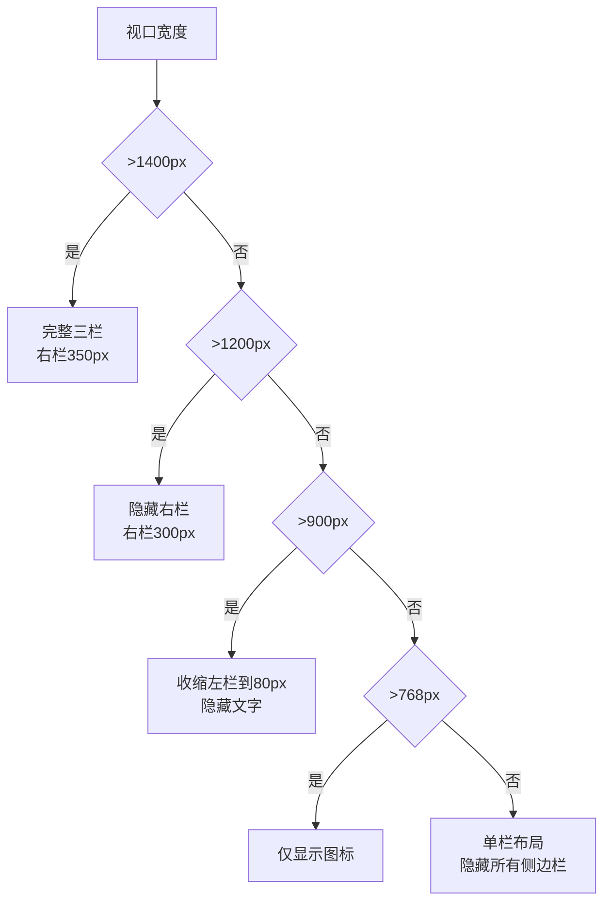

## 前言

在实现社交页面三栏布局时，遇到了诸多布局问题：内容被压缩、侧边栏重叠、响应式断点失效等。本文记录了完整的调试过程和解决方案。

## 问题诊断

### 初始布局代码

```css
.social-main {
    flex: 1;
    width: 600px;
    min-width: 0;
    margin-left: 275px;
    margin-right: 350px;
}
```

**问题表现**：
- 中间内容区域被压缩显示
- 左右侧栏与主内容重叠
- 响应式断点不生效

### 问题分析

```
┌─────────────────────────────────────────────────┐
│  Left: 275px  │  Main (600px fixed)  │  Right:  │
│   fixed       │  超出视口宽度时挤压    │  350px   │
└─────────────────────────────────────────────────┘

当视口宽度 < 600 + 275 + 350 = 1225px 时：
- 中间区域被压缩到600px以下
- 左侧栏被覆盖
- 出现水平滚动条
```

## 解决方案

### 1. 动态宽度计算

```css
.social-main {
    flex: 1;
    width: calc(100% - 275px - 350px);  /* 动态计算 */
    min-width: 0;
    max-width: 680px;                   /* 设置上限 */
    margin-left: 275px;
    margin-right: 350px;
}
```

**原理**：
- `calc(100% - left - right)` 自动适应容器宽度
- `max-width` 防止在大屏幕上过宽
- `min-width: 0` 允许收缩到更小（配合flex: 1）

### 2. 响应式断点设计



### 3. 响应式CSS实现

```css
/* 1400px: 收缩右栏 */
@media (max-width: 1400px) {
    .social-right-sidebar {
        width: 300px;
    }
    .social-main {
        width: calc(100% - 275px - 300px);
        margin-right: 300px;
    }
}

/* 1200px: 隐藏右栏 */
@media (max-width: 1200px) {
    .social-right-sidebar {
        display: none;
    }
    .social-main {
        width: calc(100% - 275px);
        margin-right: 0;
        max-width: none;
    }
}

/* 900px: 收缩左栏 */
@media (max-width: 900px) {
    .social-left-sidebar {
        width: 80px;
        padding: 12px 8px;
    }
    .sidebar-logo-text {
        display: none;
    }
    .sidebar-nav .nav-item {
        justify-content: center;
        padding: 12px;
    }
    .sidebar-nav .nav-item span {
        display: none;
    }
    .social-main {
        width: calc(100% - 80px);
        margin-left: 80px;
    }
}

/* 768px: 单栏移动端 */
@media (max-width: 768px) {
    .social-left-sidebar,
    .social-right-sidebar {
        display: none !important;
    }
    .social-layout {
        display: block;
    }
    .social-main {
        width: 100%;
        margin-left: 0;
        min-width: 0;
        border: none;
    }
}
```

### 3. 完整三栏布局结构

```
┌─────────────────────────────────────────────────────────────┐
│                        顶部导航                              │
├────────────────┬─────────────────────────────────┬──────────┤
│                │                                 │          │
│  左侧固定边栏   │       主内容区域                │ 右侧固定  │
│  width: 275px  │  width: calc(100%-625px)       │ width:   │
│  position:     │  max-width: 680px              │ 350px    │
│  fixed         │  margin-left: 275px            │ position:│
│  left: 0       │  margin-right: 350px           │ fixed    │
│                │                                 │ right: 0 │
│                │                                 │          │
└────────────────┴─────────────────────────────────┴──────────┘

各区域CSS属性对照表：

| 区域 | CSS属性 | 值 |
|------|---------|-----|
| 左栏 | position | fixed |
| 左栏 | width | 275px → 80px (@900px) |
| 左栏 | left | 0 |
| 左栏 | height | 100vh |
| 主内容 | width | calc(100%-625px) |
| 主内容 | max-width | 680px |
| 主内容 | margin-left | 275px → 80px (@900px) |
| 主内容 | margin-right | 350px → 0 (@1200px) |
| 右栏 | position | fixed |
| 右栏 | width | 350px → 300px (@1400px) |
| 右栏 | right | 0 |
```

## 常见布局问题排查

### 问题1：内容溢出容器

```css
/* 错误写法 */
.container {
    width: 600px;  /* 固定宽度，可能溢出 */
}

/* 正确写法 */
.container {
    width: calc(100% - sidebar-width);
    max-width: 700px;
    overflow-x: hidden;  /* 防止溢出显示 */
}
```

### 问题2：Flex布局中子元素不收缩

```css
/* 错误写法 */
.flex-item {
    flex: 1;
    width: 600px;  /* 固定宽度覆盖flex效果 */
}

/* 正确写法 */
.flex-item {
    flex: 1 1 0;   /* grow, shrink, basis */
    min-width: 0;  /* 允许收缩到0 */
    max-width: 100%;
}
```

### 问题3：fixed定位元素遮挡内容

```css
/* 解决方案：给主内容添加足够margin */
.main-content {
    margin-left: fixed-sidebar-width;
    margin-right: right-sidebar-width;
}

/* 或使用calc动态计算 */
.main-content {
    width: calc(100% - left - right);
}
```

## 调试技巧

### 1. 使用CSS Grid简化布局

```css
.social-layout {
    display: grid;
    grid-template-columns: 275px 1fr 350px;
    grid-template-areas: "left main right";
}

.social-left-sidebar {
    grid-area: left;
    position: sticky;
    top: 0;
    height: 100vh;
}

.social-main {
    grid-area: main;
    min-width: 0;
}

.social-right-sidebar {
    grid-area: right;
    position: sticky;
    top: 0;
    height: 100vh;
}

/* 响应式 */
@media (max-width: 1200px) {
    .social-layout {
        grid-template-columns: 275px 1fr;
        grid-template-areas: "left main";
    }
    .social-right-sidebar {
        display: none;
    }
}

@media (max-width: 900px) {
    .social-layout {
        grid-template-columns: 80px 1fr;
        grid-template-areas: "left main";
    }
}

@media (max-width: 768px) {
    .social-layout {
        display: block;
    }
    .social-left-sidebar {
        display: none;
    }
}
```

### 2. 布局调试工具

```css
/* 临时添加调试边框 */
* {
    outline: 1px solid red;
}

/* 或只调试特定元素 */
.social-layout > * {
    outline: 2px solid blue;
}

/* 使用CSS变量控制调试 */
:root {
    --debug-border: none;
}

.debug-mode {
    --debug-border: 1px solid red;
}

.debug-mode * {
    outline: var(--debug-border);
}
```

### 3. 使用Chrome DevTools

1. **Computed面板**：查看最终计算的样式值
2. **Layout面板**：可视化flex/grid布局
3. **3D视图**：查看元素堆叠层次

## 性能优化

### 1. 使用CSS containment

```css
.sidebar {
    contain: layout style;
}
```

### 2. 优化动画性能

```css
/* 使用transform和opacity */
.hover-effect {
    will-change: transform, opacity;
    transition: transform 0.2s ease, opacity 0.2s ease;
}
```

### 3. 减少重排重绘

```css
/* 避免频繁改变影响布局的属性 */
.element {
    /* 好：使用transform */
    transform: translateX(100px);
    
    /* 差：会触发重排 */
    left: 100px;
}
```

## 总结

| 问题 | 解决方案 |
|------|---------|
| 内容被压缩 | `calc(100% - sidebar-width)` |
| 侧边栏重叠 | 正确的`margin`或`padding` |
| 响应式失效 | 按设计稿设置`max-width`断点 |
| Flex不收缩 | `min-width: 0` + `flex: 1 1 0` |
| 固定定位遮挡 | 给主内容添加足够`margin` |

**最佳实践**：
1. 优先使用`calc()`进行动态宽度计算
2. 为每个响应式断点单独测试
3. 使用`min-width: 0`解决flex子元素收缩问题
4. 调试时临时添加边框可视化布局
5. 使用`will-change`优化动画性能
